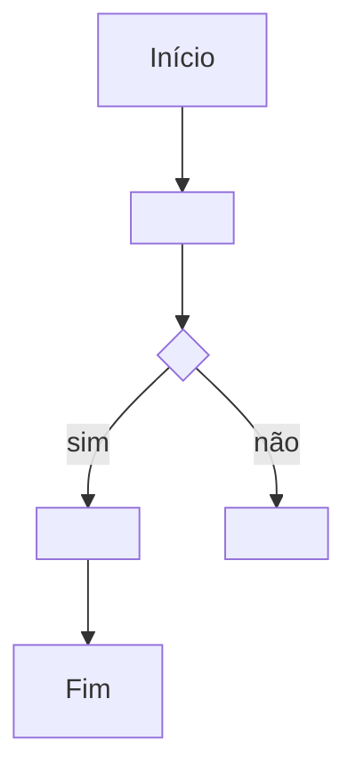

# SPEC-0000 — Modelo de Especificação

> **Instruções de uso (remover esta seção na SPEC real)**
> - Copie este arquivo para `specs/NNNN-titulo-em-kebab-case.md` usando o próximo número livre (ver `README.md`).
> - Substitua os campos entre `< >` e apague as linhas de orientação que não se aplicarem.
> - Se uma seção não se aplica, mantenha o título e escreva "Não aplicável" **com justificativa**.
> - PROIBIDO incluir segredos, credenciais ou dados reais de pacientes neste documento.

| Campo | Valor |
| :--- | :--- |
| **ID** | SPEC-0000 |
| **Título** | <título curto e específico> |
| **Status** | Rascunho |
| **Versão** | 0.1 |
| **Data** | AAAA-MM-DD |
| **Autor** | <responsável por escrever> |
| **Revisores** | <responsáveis por aprovar> |
| **Módulos afetados** | backend / frontend / banco / infraestrutura |
| **ADRs relacionados** | ADR-0006, ADR-0007, ADR-0008 |

---

## 1. Objetivo

<O que esta funcionalidade resolve, em uma ou duas frases, do ponto de vista do negócio.>

Pergunta de controle do `GEMINI.md`: **isso reduz atrito na rotina da clínica?**

## 2. Contexto

<Situação atual, dor existente, quem é afetado e por que a funcionalidade é necessária agora. Referencie
`docs/visao-produto.md` e o pilar do produto a que a SPEC pertence.>

## 3. Escopo

### 3.1 Dentro do escopo

- <item incluído>

### 3.2 Fora do escopo

- <item deliberadamente excluído, para evitar expansão de escopo>

## 4. Atores e Permissões

| Ator | Permissão necessária | Observações |
| :--- | :--- | :--- |
| <perfil: gestor, recepcionista, profissional, admin> | <permissão RBAC> | <restrições> |

A autorização é verificada **no backend, por recurso** (ADR-0008). Nunca apenas na interface.

## 5. Regras de Negócio

| ID | Regra | Justificativa / origem |
| :--- | :--- | :--- |
| RN-001 | <regra objetiva e testável> | <negócio, legal ou normativa> |
| RN-002 | | |

Regras devem ser numeradas, não se contradizer e ser rastreáveis aos critérios de aceitação.

## 6. Fluxos

### 6.1 Fluxo principal — F-001

1. <passo detalhado>
2. <passo detalhado>

### 6.2 Fluxos alternativos e exceções

- **F-002** — <situação>: <comportamento esperado>

## 7. Modelo de Dados

| Entidade | Campo | Tipo | Obrigatório | Regra / índice |
| :--- | :--- | :--- | :--- | :--- |
| <Entidade> | <campo> | <tipo> | sim/não | <unicidade, índice, formato> |

Obrigatório declarar:

- **Classificação LGPD** de cada campo com dado pessoal: comum, sensível (saúde) ou anônimo;
- **Retenção**: prazo e critério (20 anos quando envolver prontuário, conforme Lei nº 13.787/2018);
- **Exclusão/anonimização**: como atender pedidos do titular quando aplicável;
- **Migrations**: quais serão criadas (ADR-0007) — nenhuma alteração manual de schema.

## 8. Contrato de API

| Método | Rota | Autorização | Descrição |
| :--- | :--- | :--- | :--- |
| POST | `/api/v1/<recurso>` | <permissão> | <descrição> |

Para cada endpoint, declarar: entrada, saída, códigos de erro e efeitos colaterais. O contrato canônico é
o **OpenAPI gerado pelo backend** (ADR-0006); os tipos do frontend são gerados a partir dele.

## 9. Interface e Experiência

| Tela / componente | Estado | Comportamento |
| :--- | :--- | :--- |
| <tela> | vazio / carregando / erro / sucesso | <comportamento e mensagem> |

Aplicar identidade visual oficial (`docs/identidade-visual.md`), linguagem clara e orientação sobre o
próximo passo. Garantir contraste mínimo WCAG AA e navegação por teclado.

## 10. Critérios de Aceitação

Formato obrigatório: **Dado / Quando / Então**, verificável por teste.

| ID | Critério |
| :--- | :--- |
| CA-001 | **Dado** <contexto>, **Quando** <ação>, **Então** <resultado observável>. |
| CA-002 | |

Cada regra de negócio relevante deve ter pelo menos um critério de aceitação correspondente.

## 11. Casos de Erro

| ID | Gatilho | Comportamento esperado | Mensagem ao usuário | Registro |
| :--- | :--- | :--- | :--- | :--- |
| ER-001 | <entrada inválida / conflito / falha externa> | <o que o sistema faz> | <texto claro, sem detalhe técnico> | <log / auditoria> |

Nunca expor *stack trace*, nome de tabela ou detalhe interno ao usuário.

## 12. Impacto em Outras Funcionalidades

| Funcionalidade / módulo | Tipo de impacto | Ação necessária |
| :--- | :--- | :--- |
| <funcionalidade> | direto / indireto / nenhum | <atualizar SPEC X, ajustar Y> |

## 13. Requisitos de Segurança

- [ ] Autorização verificada no backend, por recurso (ADR-0008).
- [ ] Validação de entrada e de saída; proteção contra injeção (OWASP Top 10 / API Top 10).
- [ ] Nenhum segredo em código, log, mensagem de erro ou no repositório (ADR-0004).
- [ ] Dados sensíveis criptografados em trânsito e em repouso.
- [ ] Sessão/MFA tratados conforme o perfil de acesso (ADR-0008).
- [ ] Nenhum dado real de paciente em testes, seeds ou logs (ADR-0003).
- [ ] Eventos de auditoria definidos (ver seção 17).

## 14. Requisitos Legais Aplicáveis

| Norma | Aplicável? | O que exige nesta funcionalidade |
| :--- | :--- | :--- |
| LGPD (Lei nº 13.709/2018) | sim/não | <base legal, dados sensíveis, direitos do titular> |
| Lei nº 13.787/2018 (prontuário) | sim/não | <integridade, guarda de 20 anos> |
| CFM / NGS2 | sim/não | <identificação do profissional, trilha de auditoria> |
| COFEN nº 754/2024 | sim/não | <registros de enfermagem> |
| ICP-Brasil | sim/não | <assinatura com valor jurídico> |
| ANVISA RDC nº 657/2022 | sim/não | <avaliar se a funcionalidade vira SaMD> |

Ver [`docs/seguranca-e-conformidade.md`](../docs/seguranca-e-conformidade.md). "Não aplicável" exige
justificativa.

## 15. Requisitos Não Funcionais

| Categoria | Requisito |
| :--- | :--- |
| Desempenho | <tempo de resposta esperado, volume previsto> |
| Escalabilidade | <como cresce sem degradar> |
| Observabilidade | <métricas, logs estruturados, rastreamento de erro> |
| Disponibilidade | <tolerância a falha, comportamento em indisponibilidade> |

## 16. Testes Previstos

| Tipo | Cobertura mínima |
| :--- | :--- |
| Unitário | <regras de negócio e casos de erro> |
| Integração | <API, banco, migrations> |
| Comportamento | <fluxos principais e alternativos> |
| Regressão | <prevenção contra recorrência de bugs corrigidos> |

## 17. Auditoria e Observabilidade

| Evento | Recurso afetado | Dados registrados |
| :--- | :--- | :--- |
| <ex.: visualização, criação, edição, exclusão, exportação> | <recurso> | usuário, data, hora, ação, recurso |

A trilha de auditoria é *append-only* e protegida contra alteração indevida (`GEMINI.md`, seção Auditoria).

## 18. Pendências e Questões Abertas

| ID | Questão | Responsável | Prazo |
| :--- | :--- | :--- | :--- |
| Q-001 | <dúvida a resolver antes de implementar> | | |

## 19. Histórico de Revisões

| Versão | Data | Autor | Alteração |
| :--- | :--- | :--- | :--- |
| 0.1 | AAAA-MM-DD | <autor> | Versão inicial. |

## 20. Aprovação

| Papel | Nome | Data | Status |
| :--- | :--- | :--- | :--- |
| Autor | | | |
| Aprovador | | | |

---

## Exemplo de preenchimento (referência — remover na SPEC real)

| ID | Regra | Justificativa / origem |
| :--- | :--- | :--- |
| RN-001 | Um profissional não pode ter dois agendamentos sobrepostos no mesmo horário. | Integridade operacional da agenda. |
| RN-002 | O horário do agendamento deve respeitar a duração configurada do tipo de atendimento. | Regra de negócio do produto. |

| ID | Critério |
| :--- | :--- |
| CA-001 | **Dado** um profissional com agendamento às 14h00 de duração 30 min, **Quando** a recepção tentar agendar às 14h15, **Então** o sistema recusa a operação e informa o conflito. |

| ID | Gatilho | Comportamento esperado | Mensagem ao usuário | Registro |
| :--- | :--- | :--- | :--- | :--- |
| ER-001 | Conflito de horário | Não persistir o agendamento; manter a tela com os dados preenchidos. | "Este horário já está ocupado para o profissional selecionado." | Log estruturado + evento de auditoria. |
