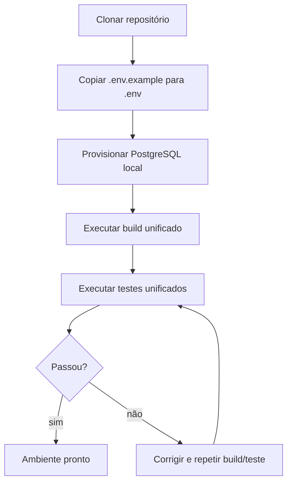
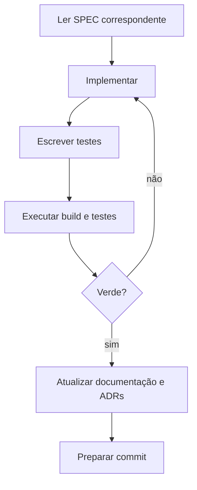
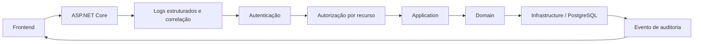

# SPEC-0001 — Fundação do Projeto (monorepo .NET + React)

| Campo | Valor |
| :--- | :--- |
| **ID** | SPEC-0001 |
| **Título** | Fundação do projeto: estrutura, convenções, build, configuração e pipelines |
| **Status** | Implementada |
| **Versão** | 1.3 |
| **Data** | 2026-09-28 |
| **Autor** | Agente de IA (Codex), sob revisão do responsável pelo projeto |
| **Revisores** | Responsável pelo projeto CANAMED |
| **Módulos afetados** | backend / frontend / banco / infraestrutura |
| **ADRs relacionados** | ADR-0002, ADR-0003, ADR-0004, ADR-0005, ADR-0006, ADR-0007, ADR-0008 |

---

## 1. Objetivo

Definir a fundação técnica do CANAMED antes da primeira funcionalidade de produto: estrutura do monorepo,
convenções de código, estratégia de configuração, ciclo de build e teste, contrato de API, tratamento de
erros e linha de base de observabilidade e auditoria.

Sem esta SPEC, cada funcionalidade futura definiria suas próprias convenções, gerando divergência — o
oposto do princípio de consistência exigido pelo projeto.

Esta SPEC **não entrega funcionalidade ao usuário final**: ela entrega o terreno sobre o qual as demais
SPECs serão implementadas.

## 2. Contexto

- O `GEMINI.md` exige SPEC antes de qualquer implementação e impõe baixo acoplamento, modularidade,
  separação de responsabilidades, observabilidade e segurança desde o início.
- O [ADR-0006](../adr/0006-stack-de-aplicacao.md) aprovou **ASP.NET Core (.NET) + SPA React em monorepo**,
  com `net10.0` e contrato OpenAPI como fronteira única.
- O [ADR-0007](../adr/0007-banco-de-dados-e-persistencia.md) aprovou **PostgreSQL** com migrations
  versionadas e auditoria *append-only*.
- O [ADR-0008](../adr/0008-autenticacao-autorizacao-e-auditoria.md) aprovou sessão em *cookie* `httpOnly`,
  Argon2id, RBAC por clínica e trilha de auditoria.
- O [ADR-0003](../adr/0003-segregacao-de-ambientes-e-uso-de-dados.md) exige quatro ambientes nomeados e
  dados sintéticos em DEV/TEST.
- O [ADR-0004](../adr/0004-gestao-de-segredos-e-configuracao.md) exige configuração por variáveis de
  ambiente e um `.env.example` versionado.
- O repositório já possui commit inicial (`a272f36`) e **não possui nenhum código ainda**.
- Ambiente verificado: .NET SDK 10.0.201, ASP.NET Core Runtime 10.0.5, Node.js v20.10.0, npm presente;
  Docker Desktop e pnpm ausentes.
- Decisões de fundação tomadas pelo responsável pelo projeto em 2026-09-28: **PostgreSQL local**,
  **npm**, **EF Core** e **.NET 10** (`net10.0`). Detalhamento na seção 18.

## 3. Escopo

### 3.1 Dentro do escopo

- Estrutura de diretórios do monorepo e arquivos de solução.
- Convenções de nomenclatura, formatação e organização de código nas duas stacks.
- Fixação de versões de ferramentas (SDK .NET, Node.js) e arquivos de configuração de editor.
- Estratégia de configuração por ambiente e `.env.example`.
- Provisionamento do PostgreSQL local e configuração do EF Core com provider Npgsql.
- Comandos padronizados de build, teste e execução local.
- Contrato de API: versionamento, formato de erro, paginação e documentação OpenAPI.
- Linha de base de logs estruturados e de eventos de auditoria.
- Estrutura de testes e ferramentas de teste por stack.
- Pipeline mínima de verificação (build + lint + testes) executável localmente.

### 3.2 Fora do escopo

- Qualquer funcionalidade de produto (agenda, fila, triagem, pagamentos, dashboards).
- Modelagem das entidades de domínio e das tabelas de negócio.
- Telas de interface, exceto as convenções gerais de organização do frontend.
- Implementação de autenticação (depende de SPEC própria, sob ADR-0008).
- Provisionamento de infraestrutura em nuvem, DNS, domínio e hospedagem (ADR futuro, com impacto em LGPD).
- Escolha de provedor de CI/CD hospedado.

## 4. Atores e Permissões

Não há ator de negócio nesta SPEC. Os atores são técnicos:

| Ator | Permissão necessária | Observações |
| :--- | :--- | :--- |
| Desenvolvedor | Acesso ao repositório e ao ambiente local | Executa build, testes e migrations locais |
| Agente de IA | Mesmas permissões do desenvolvedor, limitadas ao diretório do projeto | `git push` e alterações globais exigem autorização (ADR-0005) |

Não se aplica RBAC de produto nesta SPEC.

## 5. Regras de Negócio (convenções obrigatórias do projeto)

Estas regras são vinculantes para todas as SPECs e todo o código subsequente.

| ID | Regra | Justificativa / origem |
| :--- | :--- | :--- |
| RN-001 | Monorepo único com `backend/` e `frontend/` na raiz, ao lado de `docs/`, `specs/`, `adr/` e `assets/`. | ADR-0006; hierarquia obrigatória do `GEMINI.md`. |
| RN-002 | Backend em camadas: `Domain`, `Application`, `Infrastructure`, `Api`. `Domain` não referencia nenhuma outra camada. | Baixo acoplamento e alta coesão (`GEMINI.md`). |
| RN-003 | Nenhuma regra de negócio, autorização ou validação de integridade vive no frontend. O frontend é cliente da API. | ADR-0006; ADR-0008. |
| RN-004 | O contrato canônico da API é o OpenAPI gerado pelo backend; tipos do frontend são gerados a partir dele e nunca escritos à mão. | ADR-0006. |
| RN-005 | Toda rota de API é versionada sob `/api/v1`. | `GEMINI.md` (versionamento de API). |
| RN-006 | Toda configuração vem de variáveis de ambiente; nenhum valor sensível possui padrão (*fallback*) no código. | ADR-0004. |
| RN-007 | Alterações de schema ocorrem apenas por **EF Core Migrations** versionadas; nenhuma alteração manual. | ADR-0007; Q-003 resolvida. |
| RN-008 | Erros da API seguem o formato **RFC 7807 (Problem Details)**, sem expor detalhe interno. | Padronização e OWASP (não vazar informação). |
| RN-009 | Logs são estruturados (JSON) e nunca contêm segredos, tokens ou dados pessoais de paciente. | `GEMINI.md`; ADR-0003. |
| RN-010 | Eventos de auditoria são *append-only*, com usuário, data, hora, ação e recurso afetado. | `GEMINI.md` (Auditoria); ADR-0007. |
| RN-011 | Um único comando documentado executa build e testes das duas stacks. | Facilitar verificação e onboarding. |
| RN-012 | Nenhuma funcionalidade é implementada antes de existir SPEC aprovada. | `GEMINI.md` (regra fundamental). |
| RN-013 | Toda dependência nova precisa de justificativa na SPEC ou no PR; evitar dependências desnecessárias. | `GEMINI.md`. |
| RN-014 | Nomes de código em inglês; textos de interface e documentação em português (Brasil). | Consistência com o ecossistema e com o público-alvo. |

## 6. Fluxos

### 6.1 Fluxo principal — F-001: preparação do ambiente de desenvolvimento



1. Clonar o repositório e conferir as versões exigidas (SDK .NET e Node).
2. Criar o `.env` local a partir do `.env.example` (RN-006).
3. Provisionar o PostgreSQL local conforme a estratégia definida na SPEC.
4. Executar o comando unificado de build (RN-011).
5. Executar o comando unificado de testes; o ambiente está pronto quando ambos passam.

### 6.2 Fluxo alternativo — F-002: ciclo de uma alteração



Alteração sem SPEC aprovada não avança para implementação (RN-012).

### 6.3 Fluxo técnico — F-003: requisição HTTP típica



As etapas de autenticação e autorização serão implementadas sob SPEC própria, mas a ordem do pipeline já
fica definida aqui.

## 7. Modelo de Dados

Não aplicável a esta SPEC no que se refere a tabelas de domínio (ver seção 3.2). Ficam definidas apenas as
convenções que todas as tabelas futuras devem seguir:

| Convenção | Definição |
| :--- | :--- |
| Acesso a dados | **EF Core** com provider Npgsql; SQL bruto apenas quando justificado na SPEC da funcionalidade |
| Nomenclatura de tabelas e colunas | `snake_case`, em inglês, no plural para tabelas |
| Chave primária | `id` do tipo UUID |
| Timestamps | `created_at` e `updated_at` em UTC (`timestamptz`) |
| Exclusão | *soft delete* (`deleted_at`) apenas quando a regra de negócio exigir; caso contrário, exclusão física |
| Multi-clínica | Toda tabela de dados de clínica referencia `clinic_id`, base do isolamento do RBAC (ADR-0008) |
| Auditoria | Tabela dedicada *append-only*, detalhada na SPEC de autenticação e auditoria |
| Retenção | Declarada por tabela na SPEC correspondente; 20 anos quando houver prontuário (Lei nº 13.787/2018) |
| Classificação LGPD | Colunas com dado pessoal ou sensível marcadas na SPEC da funcionalidade (ADR-0003) |

## 8. Contrato de API

Linha de base obrigatória para todas as rotas:

| Método | Rota | Autorização | Descrição |
| :--- | :--- | :--- | :--- |
| GET | `/api/v1/health/live` | pública | Verificação de processo vivo |
| GET | `/api/v1/health/ready` | pública | Verificação de prontidão, incluindo banco |

Convenções:

- versionamento na rota (`/api/v1`), sem versionamento por cabeçalho;
- erros no formato RFC 7807 (`application/problem+json`), com `traceId` para correlação;
- paginação padronizada (página/tamanho ou cursor) definida na primeira SPEC que liste coleções;
- `Idempotency-Key` obrigatório em operações financeiras (SPEC de pagamentos);
- documentação OpenAPI publicada em `/api/v1/openapi.json` em ambiente de desenvolvimento;
- limites de requisição (*rate limiting*) aplicados a partir da SPEC de autenticação.

## 9. Interface e Experiência

Convenções do frontend, aplicáveis a todas as telas futuras:

- organização por funcionalidade (*feature folders*), não por tipo de arquivo;
- gerenciador de pacotes **npm**, com o `package-lock.json` versionado (Q-002 resolvida);
- cliente HTTP e tipos **gerados** a partir do OpenAPI (RN-004), encapsulados em uma camada única;
- todo consumo de API passa por essa camada; componentes não chamam `fetch` diretamente;
- estados obrigatórios por tela: vazio, carregando, erro e sucesso;
- idioma da interface em português (Brasil), com mensagens claras e sem jargão técnico;
- identidade visual oficial (`docs/identidade-visual.md`), contraste mínimo WCAG AA e navegação por teclado;
- nenhum dado sensível em `localStorage`, `sessionStorage` ou *caches* do navegador (ADR-0008).

## 10. Critérios de Aceitação

| ID | Critério |
| :--- | :--- |
| CA-001 | **Dado** o repositório recém-clonado, **Quando** o desenvolvedor executar o comando unificado de build, **Então** backend e frontend compilam sem erro e sem aviso de versão de SDK divergente. |
| CA-002 | **Dado** o ambiente preparado, **Quando** executar o comando unificado de testes, **Então** as duas suítes executam e reportam resultado. |
| CA-003 | **Dado** um `.env` ausente, **Quando** a aplicação iniciar, **Então** ela falha com mensagem explícita indicando a variável faltante, sem valor padrão inseguro. |
| CA-004 | **Dado** o backend em execução, **Quando** chamar `/api/v1/health/live` e `/api/v1/health/ready`, **Então** ambas respondem `200` com o banco disponível. |
| CA-005 | **Dado** um endpoint inexistente, **Quando** chamado, **Então** a resposta é RFC 7807 com `traceId`, sem *stack trace*. |
| CA-006 | **Dado** o contrato OpenAPI gerado, **Quando** executar a geração de tipos do frontend, **Então** os tipos são atualizados sem intervenção manual. |
| CA-007 | **Dado** o código-fonte, **Quando** buscar por padrões de segredo, **Então** nenhum arquivo `.env`, chave ou credencial está versionado. |
| CA-008 | **Dado** um novo diretório de funcionalidade no backend, **Quando** verificar as referências de projeto, **Então** `Domain` não referencia `Application`, `Infrastructure` nem `Api`. |
| CA-009 | **Dado** um log gerado pela aplicação, **Quando** inspecionado, **Então** está em JSON estruturado e não contém dados pessoais nem segredos. |
| CA-010 | **Dado** o `.env.example`, **Quando** comparado às variáveis exigidas pela aplicação, **Então** não há variável obrigatória ausente. |

## 11. Casos de Erro

| ID | Gatilho | Comportamento esperado | Mensagem ao usuário | Registro |
| :--- | :--- | :--- | :--- | :--- |
| ER-001 | SDK .NET ou Node em versão incompatível | Abortar o build na primeira etapa de verificação | "Versão incompatível. Esperado .NET <x> / Node <y>." | Log de build |
| ER-002 | `.env` ausente ou incompleto | Falhar na inicialização, listando as variáveis faltantes (sem valores) | "Configuração ausente: <nomes das variáveis>." | Log estruturado |
| ER-003 | Banco indisponível | `/health/ready` retorna `503`; requisições de negócio retornam erro padronizado | "Serviço temporariamente indisponível." | Log + evento de auditoria técnico |
| ER-004 | Falha na geração de tipos a partir do OpenAPI | Marcar o pipeline como falho e não publicar o frontend | N/A (falha de build) | Log de build |
| ER-005 | Migração pendente aplicada em ambiente errado | Bloquear a execução e exigir confirmação explícita | "Migração bloqueada: confirme o ambiente alvo." | Log + auditoria |

## 12. Impacto em Outras Funcionalidades

| Funcionalidade / módulo | Tipo de impacto | Ação necessária |
| :--- | :--- | :--- |
| Todas as SPECs de produto | direto | Devem seguir as convenções das seções 5 a 9 |
| SPEC de autenticação e auditoria | direto | Herda o pipeline de F-003 e as convenções de auditoria |
| SPEC de prontuário (futura) | indireto | Deve considerar a retenção de 20 anos definida na seção 7 |
| `docs/seguranca-e-conformidade.md` | indireto | Sem alteração; serve de entrada para a seção 13 |

## 13. Requisitos de Segurança

- [ ] Autorização no backend, por recurso, com RBAC por clínica (ADR-0008).
- [ ] Validação de entrada e de saída em todos os endpoints (OWASP API Top 10).
- [ ] Headers de segurança, CORS restrito e proteção CSRF coerente com sessão por *cookie*.
- [ ] Nenhum segredo em código, log, mensagem de erro, `.env.example` ou no repositório (ADR-0004).
- [ ] Dependências verificadas quanto a vulnerabilidades conhecidas antes de adotar (OWASP A06).
- [ ] Rate limiting e bloqueio progressivo previstos no pipeline (detalhados na SPEC de autenticação).
- [ ] Nenhum dado real de paciente em qualquer ambiente de desenvolvimento ou teste (ADR-0003).
- [ ] Logs sem dados pessoais e sem segredos (LGPD, minimização).

## 14. Requisitos Legais Aplicáveis

| Norma | Aplicável? | O que exige nesta funcionalidade |
| :--- | :--- | :--- |
| LGPD (Lei nº 13.709/2018) | sim | Linha de base de minimização, segurança e ausência de dados reais em desenvolvimento; sem tratamento de dados de titular nesta SPEC |
| Lei nº 13.787/2018 (prontuário) | não | Não aplicável: não há prontuário nem registro clínico nesta SPEC |
| CFM / NGS2 | não | Não aplicável: sem registro clínico ou identificação profissional |
| COFEN nº 754/2024 | não | Não aplicável: sem registros de enfermagem |
| ICP-Brasil | não | Não aplicável: sem assinatura digital |
| ANVISA RDC nº 657/2022 | não | Não aplicável: software de gestão, sem função clínica ou diagnóstica |

## 15. Requisitos Não Funcionais

| Categoria | Requisito |
| :--- | :--- |
| Desempenho | Endpoints de saúde respondendo em menos de 200 ms em ambiente local |
| Escalabilidade | Backend sem estado de sessão em memória local de processo, permitindo escala horizontal futura |
| Observabilidade | Logs estruturados em JSON com `traceId` correlacionando frontend e backend; métricas básicas expostas |
| Manutenibilidade | Build e testes executáveis por um único comando documentado (RN-011) |
| Portabilidade | Execução em Windows (ambiente atual) e em Linux (hospedagem futura), sem dependência de caminho absoluto |

## 16. Testes Previstos

| Tipo | Cobertura mínima |
| :--- | :--- |
| Unitário (backend, xUnit) | Regras de camada, formatação de erro e configuração obrigatória |
| Integração (backend) | Endpoints de saúde, conexão com banco e aplicação de migrations em banco de teste local dedicado (Docker indisponível no ambiente) |
| Unitário/componente (frontend, Vitest) | Camada de cliente HTTP e estados de tela |
| Comportamento (frontend, Playwright) | Um fluxo mínimo de navegação e um cenário de erro de API |
| Regressão | Não aplicável nesta SPEC; passa a valer a partir da primeira funcionalidade |

## 17. Auditoria e Observabilidade

| Evento | Recurso afetado | Dados registrados |
| :--- | :--- | :--- |
| Inicialização da aplicação | processo | data, hora, versão, ambiente |
| Falha de configuração | processo | variável ausente (nome apenas, nunca o valor) |
| Requisição de negócio | recurso | `traceId`, usuário (quando autenticado), rota, resultado — sem dados pessoais no corpo do log |
| Migração aplicada | banco | data, hora, ambiente, identificação da migração |

## 18. Decisões de Fundação

| ID | Questão | Decisão | Data |
| :--- | :--- | :--- | :--- |
| Q-001 | Estratégia de banco de dados local | **PostgreSQL local**, executando na máquina, sem contêiner. O modo de instalação (instalador oficial com serviço do Windows vs. binários portáteis em `D:\Tools\`) será definido na execução e exige autorização explícita, por ser alteração global do sistema | 2026-09-28 |
| Q-002 | Gerenciador de pacotes do frontend | **npm**, com `package-lock.json` versionado | 2026-09-28 |
| Q-003 | Acesso a dados no backend | **EF Core** com provider Npgsql; migrações via EF Core Migrations | 2026-09-28 |
| Q-004 | Framework alvo do backend | **`net10.0`**, com o SDK 10.0.201 fixado em `global.json` | 2026-09-28 |
| Q-005 | Orquestração do monorepo | **Scripts na raiz**: um `package.json` raiz expõe `npm run build` e `npm run test`, invocando `dotnet` e o próprio `npm`. Sem ferramenta adicional de monorepo | 2026-09-29 |
| Q-006 | Pipeline de CI | **Verificação local** nesta fase, pelos comandos unificados; CI hospedada em etapa posterior | 2026-09-29 |
| Q-007 | Retenção e formato de logs em produção | Adiado para a futura SPEC de autenticação e observabilidade; nesta fase, apenas logs estruturados em JSON | 2026-09-29 |

Não restam questões abertas nesta SPEC.

### 18.1 Pendências de Implementação

| ID | Pendência | Situação |
| :--- | :--- | :--- |
| P-001 | Instalação do PostgreSQL local | **Concluída em 2026-09-30**: PostgreSQL 18.6 portátil em `D:\Tools\PostgreSQL`, sem serviço do Windows |
| P-002 | Migrations do EF Core | **Concluída em 2026-09-30** pela [SPEC-0002](0002-spec-agenda-de-consultas.md): migration `InitialAgendaSchema` criada e aplicada |
| P-003 | Geração dos tipos do frontend a partir do OpenAPI | **Concluída em 2026-09-30** pela [SPEC-0002](0002-spec-agenda-de-consultas.md): `npm run generate:api` gera `frontend/src/api/schema.d.ts` a partir do contrato; RN-004 em vigor |
| P-004 | Testes de comportamento com Playwright | Pendente: exige download de navegadores. Rastreada como P-002 da [SPEC-0002](0002-spec-agenda-de-consultas.md), que já entregou a primeira funcionalidade |
| P-005 | Pipeline de CI hospedada | Adiado conforme Q-006 |

## 19. Histórico de Revisões

| Versão | Data | Autor | Alteração |
| :--- | :--- | :--- | :--- |
| 0.1 | 2026-09-28 | Agente de IA (Codex) | Versão inicial, derivada do ADR-0006 e demais ADRs aprovados. |
| 0.2 | 2026-09-28 | Agente de IA (Codex) | Resolve Q-001 a Q-004: PostgreSQL local, npm, EF Core e .NET 10. |
| 1.0 | 2026-09-29 | Agente de IA (Codex) | SPEC aprovada; resolve Q-005 a Q-007 (scripts raiz, verificação local, logs adiados). |
| 1.1 | 2026-09-29 | Agente de IA (Codex) | Esqueleto implementado (6 projetos .NET, frontend React/Vite, arquivos raiz, comandos unificados); registradas as pendências P-001 a P-005. |
| 1.2 | 2026-09-30 | Agente de IA (Codex) | P-001 concluída (PostgreSQL 18.6 portátil); rota do documento OpenAPI fixada em `/api/v1/openapi.json`, conforme a seção 8. |
| 1.3 | 2026-09-30 | Agente de IA (Codex) | P-002 e P-003 concluídas pela SPEC-0002 (migrations do EF Core e geração dos tipos do frontend a partir do OpenAPI); P-004 passa a ser rastreada na SPEC-0002. |

## 20. Aprovação

| Papel | Nome | Data | Status |
| :--- | :--- | :--- | :--- |
| Autor | Agente de IA (Codex) | 2026-09-28 | Escrita |
| Aprovador | Responsável pelo projeto CANAMED | 2026-09-29 | **Aprovado** |

---

## Anexo A — Estrutura de diretórios proposta

```text
/
├─ .editorconfig
├─ .gitignore
├─ .gitattributes
├─ .env.example
├─ global.json
├─ Canamed.sln
├─ Directory.Build.props
├─ package.json
├─ README.md
├─ adr/
├─ assets/
├─ docs/
├─ specs/
├─ backend/
│  ├─ src/
│  │  ├─ Canamed.Domain/
│  │  ├─ Canamed.Application/
│  │  ├─ Canamed.Infrastructure/
│  │  └─ Canamed.Api/
│  └─ tests/
│     ├─ Canamed.UnitTests/
│     └─ Canamed.IntegrationTests/
└─ frontend/
   ├─ src/
   │  ├─ app/
   │  ├─ features/
   │  ├─ shared/
   │  └─ api/            (tipos gerados a partir do OpenAPI)
   └─ tests/
```

## Anexo B — Arquivos de fundação a criar

| Arquivo | Finalidade |
| :--- | :--- |
| `global.json` | Fixar o SDK **10.0.201** (`net10.0`) e a política de `rollForward` (Q-004 resolvida) |
| `.editorconfig` | Unificar formatação entre C# e TypeScript |
| `Directory.Build.props` | Convenções comuns de compilação (nullable, warnings como erro, idioma) |
| `.env.example` | Listar as variáveis exigidas, sem valores sensíveis (ADR-0004) |
| `.gitattributes` | Normalizar fim de linha (`* text=auto eol=lf`) e marcar binários, evitando churn entre Windows e Linux |
| `README.md` raiz | Pré-requisitos, provisionamento e comandos unificados (RN-011) |
| `Canamed.sln` | Solução com os quatro projetos do backend e os projetos de teste |
| `package.json` raiz | Expor `npm run build` e `npm run test`, orquestrando backend e frontend (Q-005) |
