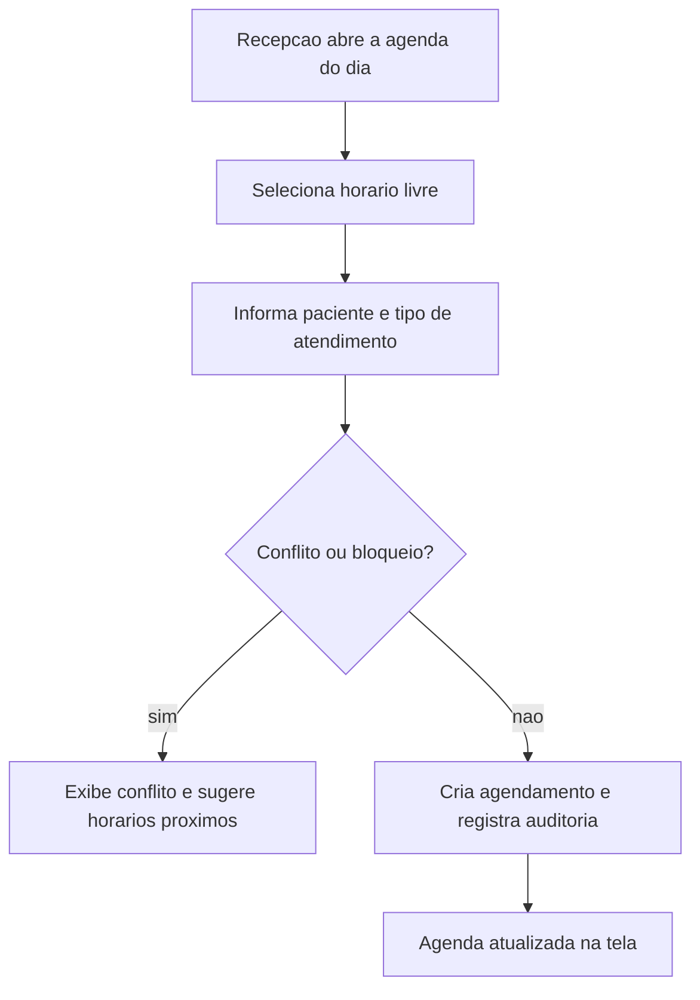

# SPEC-0002 — Agenda de Consultas

| Campo | Valor |
| :--- | :--- |
| **ID** | SPEC-0002 |
| **Título** | Agendamento, remarcação e cancelamento de consultas |
| **Status** | Implementada |
| **Versão** | 1.0 |
| **Data** | 2026-09-30 |
| **Autor** | Agente de IA (Codex), sob revisão do responsável pelo projeto |
| **Revisores** | Responsável pelo projeto CANAMED |
| **Módulos afetados** | backend / frontend / banco |
| **ADRs relacionados** | ADR-0003, ADR-0004, ADR-0006, ADR-0007, ADR-0008, ADR-0009 |

---

## 1. Objetivo

Permitir que a recepção agende, remarque e cancele consultas de forma rápida e sem conflito de horários,
com uma visão clara da agenda de cada profissional.

Pergunta de controle do `GEMINI.md`: **isso reduz atrito na rotina da clínica?**
Sim: substitui a agenda manual por um fluxo que impede sobreposição de horários e preserva o histórico.

## 2. Contexto

É o primeiro pilar do produto (`docs/visao-produto.md`, seção 5.1) e a base para fila de espera, triagem,
pagamento pré-consulta e dashboards. A fundação técnica já existe (`specs/0001-spec-de-fundacao.md`),
com PostgreSQL 18.6, EF Core e esqueleto de API e frontend em operação.

## 3. Escopo

### 3.1 Dentro do escopo

- Cadastro mínimo de profissional, paciente e tipo de atendimento (o necessário para agendar).
- Criação, remarcação e cancelamento de agendamento.
- Detecção e bloqueio de conflito de horário por profissional.
- Visão da agenda por dia e por profissional.
- Histórico e auditoria das alterações.

### 3.2 Fora do escopo

- Prontuário, triagem, fila de espera e pagamentos (pilares com SPEC própria).
- Cadastro completo de paciente e profissional (dados clínicos, convênios, especialidades).
- Notificações ao paciente (WhatsApp, SMS, e-mail).
- Múltiplas salas, equipamentos e telemedicina.
- Relatórios e dashboards gerenciais.
- Autenticação e gestão de usuários, que dependem de SPEC própria sob o ADR-0008.

## 4. Atores e Permissões

| Ator | Permissão necessária | Observações |
| :--- | :--- | :--- |
| Recepcionista | `agenda:write` | Cria, remarca e cancela agendamentos da própria clínica |
| Profissional de saúde | `agenda:read:own`, `agenda:block` | Consulta a própria agenda e bloqueia horários |
| Gestor | `agenda:read`, `agenda:write`, `agenda:configure` | Configura tipos de atendimento e durações |

Toda autorização é verificada **no backend, por recurso**, com isolamento por `clinic_id` (ADR-0008).
A verificação é feita rota a rota por um filtro de permissões; o acesso negado gera evento de auditoria.
Enquanto a SPEC de autenticação não existe, a identidade em DEV/TEST é resolvida por cabeçalho
conforme o [ADR-0009](../adr/0009-identidade-de-desenvolvimento-e-autorizacao-temporaria.md), com
fail closed fora desses ambientes.

## 5. Regras de Negócio

| ID | Regra | Justificativa / origem |
| :--- | :--- | :--- |
| RN-001 | Dois agendamentos ativos do mesmo profissional não podem se sobrepor no tempo. | Integridade operacional da agenda |
| RN-002 | A duração do agendamento é sempre a duração vigente do tipo de atendimento no momento da criação. | Consistência do catálogo |
| RN-003 | Não é permitido criar agendamento com início no passado. | Evita erro de digitação |
| RN-004 | Todo agendamento pertence a exatamente uma clínica (`clinic_id`) e a um profissional dela. | Isolamento multi-clínica (ADR-0008) |
| RN-005 | Status possíveis: `agendado`, `confirmado`, `atendido`, `cancelado`, `faltou`. | Ciclo de vida explícito |
| RN-006 | Cancelamento exige motivo e não remove o registro; a agenda libera o horário. | Rastreabilidade e reocupação |
| RN-007 | Remarcação cria um novo intervalo e mantém o histórico da alteração. | Rastreabilidade |
| RN-008 | Somente agendamentos com status `agendado` ou `confirmado` podem ser remarcados ou cancelados. | Evita inconsistência de estado |
| RN-009 | Conflito de horário retorna erro `409`, nunca sobrescreve silenciosamente. | Previsibilidade para a recepção |
| RN-010 | Todo horário é armazenado em UTC (`timestamptz`) e exibido em `America/Fortaleza`. | Correção em fusos e horário de verão |
| RN-011 | Bloqueio de agenda do profissional impede novos agendamentos naquele intervalo. | Controle do profissional |
| RN-012 | Exclusão de agendamento é *soft delete*; cancelamento é mudança de status. | Histórico íntegro |
| RN-013 | Toda criação, alteração, remarcação e cancelamento gera evento de auditoria. | Exigência do `GEMINI.md` |
| RN-014 | Dados de paciente jamais aparecem em logs de aplicação. | LGPD e RN-009 da SPEC-0001 |

## 6. Fluxos

### 6.1 F-001 — Criar agendamento

### 6.2 F-002 — Remarcar

1. Recepção seleciona o agendamento e escolhe "Remarcar".
2. Informa o novo horário; o sistema valida conflito e bloqueio.
3. O intervalo anterior é liberado e a alteração é registrada na auditoria.

### 6.3 F-003 — Cancelar

1. Recepção seleciona o agendamento e escolhe "Cancelar".
2. Informa o motivo (obrigatório) e confirma.
3. Status muda para `cancelado`; o horário volta a ficar livre; evento de auditoria é gravado.

### 6.4 F-004 — Consultar agenda do dia

1. Recepção escolhe data e profissional.
2. O sistema retorna os agendamentos do dia com paciente, tipo, horário e status.
3. Horários bloqueados aparecem como indisponíveis, sem expor motivo clínico.

## 7. Modelo de Dados

| Entidade | Campo | Tipo | Obrigatório | Regra / índice |
| :--- | :--- | :--- | :--- | :--- |
| `clinics` | `id`, `name` | uuid, text | sim | Raiz do isolamento |
| `professionals` | `id`, `clinic_id`, `name` | uuid, text | sim | Índice em `clinic_id` |
| `patients` | `id`, `clinic_id`, `name`, `phone` | uuid, text | sim | Índice em `(clinic_id, name)` |
| `appointment_types` | `id`, `clinic_id`, `name`, `duration_minutes` | uuid, text, int | sim | `duration_minutes` > 0 |
| `appointments` | `id`, `clinic_id`, `professional_id`, `patient_id`, `appointment_type_id`, `starts_at`, `duration_minutes`, `status`, `cancellation_reason`, `created_at`, `updated_at`, `deleted_at` | conforme tipo | sim, exceto motivo e `deleted_at` | Índice em `(professional_id, starts_at)` |
| `professional_blocks` | `id`, `professional_id`, `starts_at`, `ends_at`, `reason` | uuid, timestamptz, text | sim, exceto motivo | Índice em `(professional_id, starts_at)` |

Regras de integridade:

- **Conflito de sobreposição (RN-001)** deve ser garantido no banco, e não apenas na aplicação.
- Todas as tabelas seguem as convenções da seção 7 da SPEC-0001 (UUID, `snake_case`, timestamps UTC, `clinic_id`).
- **Classificação LGPD**: `patients.name` e `patients.phone` são dados pessoais; o agendamento, ao revelar
  que a pessoa é paciente de uma clínica, é dado sensível de saúde.
- **Retenção**: agendamentos são mantidos enquanto durar o contrato da clínica; não são prontuário.
  A política definitiva de retenção e eliminação será definida na SPEC de privacidade e direitos do titular.
- **Migrations**: criadas via EF Core Migrations (P-002 da SPEC-0001 fica resolvida por esta SPEC).

## 8. Contrato de API

| Método | Rota | Autorização | Descrição |
| :--- | :--- | :--- | :--- |
| POST | `/api/v1/appointments` | `agenda:write` | Cria agendamento |
| GET | `/api/v1/appointments?date=&professionalId=` | `agenda:read` ou `agenda:read:own` | Lista a agenda do dia |
| GET | `/api/v1/appointments/{id}` | `agenda:read` ou `agenda:read:own` | Detalha um agendamento |
| POST | `/api/v1/appointments/{id}/reschedule` | `agenda:write` | Remarca |
| POST | `/api/v1/appointments/{id}/cancel` | `agenda:write` | Cancela com motivo |
| POST | `/api/v1/appointments/{id}/attend` | `agenda:write` | Registra que o paciente foi atendido |
| POST | `/api/v1/appointments/{id}/no-show` | `agenda:write` | Registra a falta do paciente |
| POST | `/api/v1/professionals/{id}/blocks` | `agenda:block` ou `agenda:write` | Bloqueia intervalo |
| GET | `/api/v1/professionals/{id}/blocks?date=` | `agenda:read`, `agenda:read:own`, `agenda:write` ou `agenda:block` | Lista bloqueios do dia |
| GET | `/api/v1/professionals` | `agenda:read`, `agenda:read:own`, `agenda:write` ou `agenda:block` | Lista profissionais (cadastro mínimo) |
| POST | `/api/v1/professionals` | `agenda:write` | Cadastra profissional (cadastro mínimo) |
| GET | `/api/v1/patients` | `agenda:read`, `agenda:read:own`, `agenda:write` ou `agenda:block` | Lista pacientes (cadastro mínimo) |
| POST | `/api/v1/patients` | `agenda:write` | Cadastra paciente (cadastro mínimo) |
| GET | `/api/v1/appointment-types` | idem acima | Lista tipos de atendimento |
| POST | `/api/v1/appointment-types` | `agenda:configure` | Cadastra tipo de atendimento e duração |

> As rotas de profissionais, pacientes e tipos de atendimento entregam apenas o **cadastro mínimo**
> necessário para agendar (seção 3.1) e existem para que a recepção opere sem depender de outra
> funcionalidade. O cadastro completo (dados clínicos, convênios, especialidades) permanece fora do escopo.

- Erros seguem RFC 7807 (`application/problem+json`), conforme a SPEC-0001.
- Conflito de horário: `409` com `type` `appointment-overlap` ou `professional-blocked`, além de
  `requestedStartsAt` e `suggestions` (próximos horários livres, em UTC, na grade de 15 minutos).
- Sem permissão: `403` com `type` `permission-denied`; sem identidade resolvida: `401`
  (`authentication-required`), conforme o ADR-0009.
- `date` é interpretado no fuso `America/Fortaleza`; todas as respostas usam instantes em UTC (RN-010).
- O motivo do bloqueio de agenda **não** é devolvido na consulta da agenda (F-004, item 3): a resposta
  informa apenas o intervalo indisponível. O motivo permanece na trilha de auditoria.
- Somente agendamentos `agendado` ou `confirmado` ocupam o horário (RN-001). Estados terminais
  (`atendido`, `faltou`, `cancelado`) liberam o intervalo — regra garantida no banco pela restrição
  `ex_appointments_professional_no_overlap`, alinhada ao domínio pela migration
  `AlignAgendaExclusionWithActiveStatuses`.
- Nenhuma resposta expõe dados de paciente de outra clínica.

## 9. Interface e Experiência

| Tela | Estado | Comportamento |
| :--- | :--- | :--- |
| Agenda do dia | vazio | "Nenhum agendamento para esta data." |
| Agenda do dia | carregando | Esqueleto de carregamento, sem bloquear a tela |
| Agenda do dia | erro | Mensagem clara com ação de tentar novamente |
| Criação | conflito | Destaca o horário e sugere os mais próximos |
| Cancelamento | confirmação | Exige motivo antes de confirmar |

Identidade visual oficial, contraste WCAG AA, navegação por teclado e linguagem sem jargão técnico.

## 10. Critérios de Aceitação

| ID | Critério |
| :--- | :--- |
| CA-001 | **Dado** um profissional com agendamento às 14h00 de 30 min, **Quando** a recepção tentar agendar às 14h15, **Então** o sistema recusa com `409` e informa o conflito. |
| CA-002 | **Dado** um horário livre, **Quando** a recepção criar o agendamento, **Então** ele aparece na agenda do profissional no dia correto e em `America/Fortaleza`. |
| CA-003 | **Dado** um agendamento `agendado`, **Quando** a recepção remarcar para um horário livre, **Então** o horário antigo fica livre e o novo consta como ativo. |
| CA-004 | **Dado** um agendamento `agendado`, **Quando** a recepção cancelar com motivo, **Então** o status muda para `cancelado`, o horário é liberado e o motivo fica registrado. |
| CA-005 | **Dado** um agendamento, **Quando** um usuário de outra clínica tentar acessá-lo, **Então** o sistema responde `404`, sem revelar a existência do registro. |
| CA-006 | **Dado** um intervalo bloqueado, **Quando** a recepção tentar agendar nele, **Então** o sistema recusa com `409`. |
| CA-007 | **Dado** um agendamento `atendido`, **Quando** a recepção tentar cancelar, **Então** o sistema recusa com `409` (RN-008). |
| CA-008 | **Dado** um agendamento criado ou alterado, **Quando** consultada a auditoria, **Então** constam usuário, data, hora, ação e recurso afetado. |
| CA-009 | **Dado** um horário no passado, **Quando** a recepção tentar agendar, **Então** o sistema recusa com `400` (RN-003). |
| CA-010 | **Dado** um agendamento de 30 min, **Quando** o tipo de atendimento for alterado para 60 min, **Então** os agendamentos existentes mantêm a duração original (RN-002). |
| CA-011 | **Dado** um agendamento `agendado`, **Quando** a recepção registrar o atendimento, **Então** o status passa a `atendido`, o horário deixa de ocupar a agenda e o agendamento não aceita mais cancelamento (RN-008). |
| CA-012 | **Dado** um agendamento `agendado`, **Quando** a recepção registrar a falta, **Então** o status passa a `faltou`, o horário é liberado e o evento fica na auditoria. |

## 11. Casos de Erro

| ID | Gatilho | Comportamento esperado | Mensagem ao usuário | Registro |
| :--- | :--- | :--- | :--- | :--- |
| ER-001 | Conflito de horário | Não persistir; retornar `409` | "Este horário já está ocupado para o profissional selecionado." | Log + auditoria |
| ER-002 | Horário bloqueado | Não persistir; retornar `409` | "O profissional está indisponível neste horário." | Log + auditoria |
| ER-003 | Data no passado | Recusar com `400` | "Não é possível agendar em data passada." | Log |
| ER-004 | Status inválido para a operação | Recusar com `409` | "Este agendamento não pode mais ser alterado." | Log + auditoria |
| ER-005 | Paciente ou profissional de outra clínica | Responder `404` | "Registro não encontrado." | Log de segurança |
| ER-006 | Falha de conexão com o banco | Retornar `503` em Problem Details | "Serviço temporariamente indisponível." | Log estruturado |

## 12. Impacto em Outras Funcionalidades

| Funcionalidade | Tipo | Ação necessária |
| :--- | :--- | :--- |
| Fila de espera (futura) | direto | Consumirá o agendamento como origem do paciente |
| Triagem, pagamento e dashboards (futuros) | indireto | Dependem do ciclo de vida definido na RN-005 |
| SPEC de autenticação e auditoria | direto | Fornece permissões, `clinic_id` e trilha de auditoria |
| SPEC-0001 (fundação) | indireto | **Resolvido nesta SPEC**: P-002 (migrations do EF Core) e P-003 (geração dos tipos do frontend a partir do OpenAPI, `npm run generate:api`) |
| `docs/visao-produto.md` | indireto | O pilar 5.1 (gestão de agenda) deixa de ser somente visão e passa a ter implementação rastreável nesta SPEC |

## 13. Requisitos de Segurança

- [x] Autorização por recurso no backend, com isolamento obrigatório por `clinic_id`
  (filtro de permissões por rota + `ClinicId` do ator em todas as consultas; evidência: `CA-005`).
- [x] Validação de entrada e de saída em todos os endpoints (OWASP API Top 10)
  (validação no domínio e na aplicação; erros em Problem Details sem detalhe interno).
- [x] Conflito garantido no banco, não apenas na aplicação (evita *double booking* sob concorrência)
  (restrição de exclusão `ex_appointments_professional_no_overlap` + `pg_advisory_xact_lock` por profissional).
- [x] Nenhum dado de paciente em logs, mensagens de erro ou telemetria (RN-014)
  (logs estruturados registram rota, status e `traceId`; nenhuma mensagem de erro contém nome ou telefone).
- [x] Trilha de auditoria *append-only* para as mutações
  (`audit_events` com gatilho `trg_audit_events_append_only` que rejeita `UPDATE` e `DELETE`).
- [x] Nenhum dado real de paciente em testes, seeds ou fixtures (ADR-0003)
  (nomes, telefones e clínicas marcados como sintéticos; banco de teste isolado e validado por nome).

## 14. Requisitos Legais Aplicáveis

| Norma | Aplicável? | O que exige nesta funcionalidade |
| :--- | :--- | :--- |
| LGPD (Lei nº 13.709/2018) | sim | Base legal, minimização, segurança e registro de operações com dados pessoais e sensíveis |
| Lei nº 13.787/2018 (prontuário) | não | Não há prontuário nem registro clínico nesta funcionalidade |
| CFM / NGS2 | não | Sem conteúdo clínico; apenas dados administrativos de agendamento |
| COFEN nº 754/2024 | não | Sem registros de enfermagem |
| ICP-Brasil | não | Sem assinatura digital |
| ANVISA RDC nº 657/2022 | não | Software de gestão, sem função diagnóstica ou terapêutica |

## 15. Requisitos Não Funcionais

| Categoria | Requisito |
| :--- | :--- |
| Desempenho | Agenda de um profissional/dia em menos de 500 ms com até 60 agendamentos |
| Concorrência | Duas requisições simultâneas para o mesmo horário não podem gerar dois agendamentos ativos |
| Observabilidade | `traceId` presente nas respostas de erro e nos logs |
| Manutenibilidade | Regras de conflito isoladas no domínio, testáveis sem banco |

## 16. Testes Previstos

| Tipo | Cobertura mínima |
| :--- | :--- |
| Unitário | Regras de conflito, transições de status e cálculo de duração (RN-001, RN-002, RN-005, RN-008) |
| Integração | Endpoints, *soft delete*, auditoria e isolamento por `clinic_id` |
| Comportamento | Fluxos F-001 a F-004, incluindo conflito e cancelamento |
| Regressão | Concorrência no mesmo horário |

### 16.1 Cobertura implementada

| Tipo | Situação | Evidência |
| :--- | :--- | :--- |
| Unitário (backend) | Implementado | `backend/tests/Canamed.UnitTests/Agenda` — 25 casos de teste de regras de conflito, transições de status, duração vigente e sugestão de horários livres |
| Integração (backend) | Implementado | `backend/tests/Canamed.IntegrationTests/Agenda` — 16 testes cobrindo CA-001 a CA-012, permissões, isolamento por clínica, auditoria e *append-only* |
| Frontend (Vitest) | Implementado | `frontend/src/features/agenda/*.test.ts(x)` — estados de tela, cliente HTTP, formato de horário e sugestões de conflito |
| Comportamento (Playwright) | Implementado | `frontend/e2e` — 10 cenários cobrindo F-001 a F-004, login com e sem segundo fator e a proteção do sistema |
| Regressão de concorrência | Implementado no banco | Restrição de exclusão `ex_appointments_professional_no_overlap` + trava por profissional (`pg_advisory_xact_lock`) |

## 17. Auditoria e Observabilidade

| Evento | Recurso afetado | Dados registrados |
| :--- | :--- | :--- |
| Agendamento criado | `appointments` | usuário, data, hora, `clinic_id`, identificador do agendamento |
| Agendamento remarcado | `appointments` | usuário, data, hora, horário anterior e novo |
| Agendamento cancelado | `appointments` | usuário, data, hora, motivo |
| Agendamento atendido | `appointments` | usuário, data, hora, `clinic_id`, identificador do agendamento |
| Falta registrada | `appointments` | usuário, data, hora, `clinic_id`, identificador do agendamento |
| Bloqueio de agenda criado | `professional_blocks` | usuário, data, hora, intervalo |
| Acesso negado por clínica | `appointments` | usuário, data, hora, recurso, motivo da negativa |

## 18. Decisões de Produto e Pendências

### 18.1 Questões resolvidas

As decisões abaixo foram registradas em 2026-09-30, por instrução direta do responsável pelo projeto
("seguir todos os documentos de regra e concluir o projeto"), e ficam documentadas para ratificação
explícita. Nenhuma delas contradiz o `GEMINI.md` ou um ADR aceito.

| ID | Questão | Decisão | Justificativa |
| :--- | :--- | :--- | :--- |
| Q-001 | Granularidade da agenda e duração padrão | Sugestões de horário livre na **grade de 15 minutos**; duração padrão de **30 minutos** no tipo "Consulta" criado pelos dados sintéticos. A duração real é sempre a do tipo de atendimento (RN-002) | 15 minutos é o menor múltiplo comum prático (comporta 15/20/30/45/60) e reduz o atrito para reaproveitar um horário liberado. A grade é apenas uma convenção de sugestão, não uma regra de bloqueio |
| Q-002 | Encaixe/overbooking pela recepção | **Não permitido** nesta versão: RN-001 é absoluta e validada também no banco | Sobresposição silenciosa gera conflito operacional e é exatamente o problema que a agenda resolve. Reavaliar com dados reais de uso, via nova SPEC ou ADR |
| Q-003 | Antecedência mínima para cancelamento | **Sem antecedência mínima** nesta versão | Não há impacto operacional conhecido; restringir agora adicionaria atrito sem evidência. Reavaliar com uso real |
| Q-004 | Origem do status `confirmado` | **Manual, pela recepção** | Confirmação automática depende de notificações ao paciente (WhatsApp/SMS/e-mail), que estão fora do escopo. O estado `confirmado` já existe no ciclo de vida (RN-005) e mantém o horário ocupado |
| Q-005 | Profissional em mais de uma clínica | **Permitido**: cada vínculo é um registro de `professionals` com seu `clinic_id` | Mantém o isolamento multi-clínica (RN-004) sem introduzir entidade de pessoa física. O mesmo indivíduo terá um registro por clínica |
| Q-006 | Retenção de agendamentos cancelados e pacientes inativos | **Nenhuma exclusão automática** nesta versão: cancelamento preserva o registro (RN-006) e a remoção é *soft delete* (RN-012) | Rastreabilidade e reocupação do horário. A política definitiva de retenção e eliminação de dados pessoais pertence à SPEC de privacidade e direitos do titular |

### 18.2 Pendências de implementação

| ID | Pendência | Situação |
| :--- | :--- | :--- |
| P-001 | Paginação das listas de agenda e cadastros | Não aplicável: a agenda é consultada por dia e profissional; o catálogo mínimo é pequeno. Deve ser tratada na primeira SPEC que liste coleções maiores (SPEC-0001, seção 8) |
| P-002 | Testes de comportamento (Playwright) dos fluxos F-001 a F-004 | **Concluída em 2026-10-01**: `frontend/e2e` cobre agenda do dia, criação, conflito com sugestões, remarcação, cancelamento com motivo e bloqueio de agenda, com sessão autenticada real (`npm run test:e2e`) |
| P-003 | Endpoint para marcar `atendido`/`faltou` | **Concluída em 2026-09-30**: `POST /appointments/{id}/attend` e `POST /appointments/{id}/no-show`, com auditoria e cobertura de integração (CA-011 e CA-012) |
| P-004 | Confirmação automática do paciente (Q-004) | Depende de SPEC de notificações |
| P-005 | Horário comercial e feriados por clínica | Fora do escopo; hoje o bloqueio de agenda cobre a indisponibilidade (RN-011) |
| P-006 | Substituição da identidade de desenvolvimento pela autenticação real | Depende da SPEC de autenticação e auditoria (ADR-0008); ver ADR-0009 |

## 19. Histórico de Revisões

| Versão | Data | Autor | Alteração |
| :--- | :--- | :--- | :--- |
| 0.1 | 2026-09-30 | Agente de IA (Codex) | Versão inicial. |
| 1.0 | 2026-09-30 | Agente de IA (Codex) | Aprovada e implementada: Q-001 a Q-006 resolvidas (seção 18.1); contrato de API ampliado com as rotas de cadastro mínimo, bloqueios e erros de autorização; critérios CA-001 a CA-010 verificados por testes unitários e de integração; migration `InitialAgendaSchema` criada e aplicada; frontend da agenda implementado. Registrada a cobertura de testes (seção 16.1) e as pendências P-001 a P-006. |
| 1.1 | 2026-09-30 | Agente de IA (Codex) | Fechamento do ciclo de vida do atendimento (P-003): rotas `attend` e `no-show`, com auditoria e critérios CA-011 e CA-012; migration `AlignAgendaExclusionWithActiveStatuses` alinhou a restrição de exclusão à definição de agendamento ativo do domínio. |
| 1.2 | 2026-10-01 | Agente de IA (Codex) | P-002 concluída: suíte de comportamento (Playwright) cobrindo os fluxos F-001 a F-004 na interface, com sessão autenticada real; cobertura marcada como implementada na seção 16.1. |

## 20. Aprovação

| Papel | Nome | Data | Status |
| :--- | :--- | :--- | :--- |
| Autor | Agente de IA (Codex) | 2026-09-30 | Escrita |
| Aprovador | Responsável pelo projeto CANAMED | 2026-09-30 | **Aprovado** — por instrução direta de conclusão do projeto, com as decisões da seção 18.1 registradas para ratificação |

> Ratificação: as decisões Q-001 a Q-006 (seção 18.1) foram tomadas pelo agente por instrução direta do
> responsável pelo projeto em 2026-09-30. Se alguma delas precisar mudar, o caminho é uma revisão
> registrada nesta SPEC (ou um novo ADR quando a mudança for arquitetural), conforme o `specs/README.md`.
