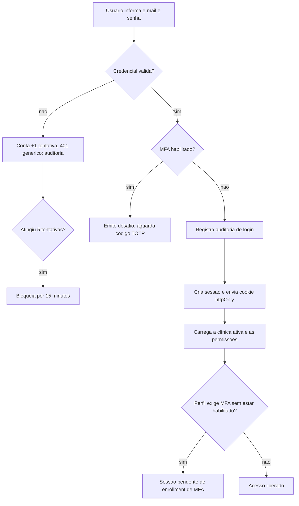

# SPEC-0003 — Autenticação, Autorização e Auditoria

| Campo | Valor |
| :--- | :--- |
| **ID** | SPEC-0003 |
| **Título** | Login de usuários, sessão segura, papéis por clínica e trilha de auditoria |
| **Status** | Implementada |
| **Versão** | 1.0 |
| **Data** | 2026-10-01 |
| **Autor** | Agente de IA (Codex), sob revisão do responsável pelo projeto |
| **Revisores** | Responsável pelo projeto CANAMED |
| **Módulos afetados** | backend / frontend / banco |
| **ADRs relacionados** | ADR-0003, ADR-0004, ADR-0006, ADR-0007, ADR-0008, ADR-0009, ADR-0010 |

---

## 1. Objetivo

Entregar a autenticação de usuários, a autorização por recurso com papéis por clínica e a trilha de
auditoria de eventos de identidade, substituindo o mecanismo temporário do ADR-0009 e cumprindo o
[ADR-0008](../adr/0008-autenticacao-autorizacao-e-auditoria.md).

Pergunta de controle do `GEMINI.md`: **isso reduz atrito na rotina da clínica?**
Sim: cada pessoa entra com a própria credencial, enxerga somente o que o seu papel permite e a clínica
passa a ter rastreabilidade de quem acessou e alterou cada informação — base exigida pela LGPD, pelo CFM
e pela Lei nº 13.787/2018.

## 2. Contexto

- O ADR-0008 decidiu sessão em *cookie* `httpOnly` + `Secure` + `SameSite`, Argon2id, MFA (TOTP) para
  perfis administrativos, RBAC por clínica, bloqueio progressivo e auditoria *append-only*.
- A [SPEC-0001](0001-spec-de-fundacao.md) deixou a autenticação fora de escopo e definiu o *pipeline*
  (configuração → identidade → autorização por recurso → caso de uso → auditoria).
- A [SPEC-0002](0002-spec-agenda-de-consultas.md) implementou as permissões de agenda
  (`agenda:read`, `agenda:read:own`, `agenda:write`, `agenda:block`, `agenda:configure`) e a trilha de
  auditoria, mas a identidade ainda é resolvida por cabeçalho em desenvolvimento (ADR-0009).
- Nenhuma funcionalidade de produto pode ir a produção com o mecanismo do ADR-0009, que é explicitamente
  temporário e restrito a DEV/TEST.

## 3. Escopo

### 3.1 Dentro do escopo

- Cadastro de usuários por clínica, com papel (`gestor`, `recepcionista`, `profissional`) e vínculo
  opcional a um profissional da agenda.
- Login por e-mail e senha, com senha protegida por Argon2id e bloqueio progressivo por tentativas.
- Segundo fator (TOTP) obrigatório para o papel `gestor`, opcional para os demais.
- Sessão em *cookie* `httpOnly`, com expiração deslizante, expiração absoluta e revogação.
- Troca da própria senha e redefinição de senha pelo gestor.
- Autorização por recurso, reaproveitando o filtro de permissões já existente e acrescentando
  `users:manage`.
- Auditoria dos eventos de identidade (login, falha, logout, MFA, senha, usuário, sessão) e das
  tentativas de acesso negado.
- Proteções de borda: limitação de requisições no login, exigência de cabeçalho anti-CSRF em métodos que
  alteram estado e CORS restrito com credenciais.
- Tela de login (com passo de MFA), sessão no frontend e painel mínimo de usuários para o gestor.

### 3.2 Fora do escopo

- Autoatendimento de recuperação de senha por e-mail (depende da SPEC de notificações).
- Federação/SSO corporativo e login social.
- Códigos de recuperação de MFA e mais de um fator simultâneo.
- Gestão de múltiplas clínicas pela mesma pessoa na interface (o modelo suporta; a troca de clínica
  ativa existe na API).
- Convites por e-mail, expiração de senha por tempo, histórico de senhas.
- Criptografia de disco/coluna em nível de infraestrutura, backups e região de dados (ADR futuro de
  hospedagem).
- Termos de uso, consentimento e direitos do titular (SPEC de privacidade).

## 4. Atores e Permissões

| Ator | Permissões | Observações |
| :--- | :--- | :--- |
| Gestor | `agenda:read`, `agenda:write`, `agenda:block`, `agenda:configure`, `users:manage` | MFA obrigatório; único papel que administra usuários da clínica |
| Recepcionista | `agenda:read`, `agenda:write` | MFA opcional nesta versão |
| Profissional | `agenda:read:own`, `agenda:block` | Vinculado a um registro de `professionals`; MFA opcional |
| Sistema | — | Registra auditoria, aplica bloqueio progressivo e limita requisições |

Regras de autorização:

- toda rota privada exige sessão válida e permissão verificada **no backend**, por recurso;
- o `clinic_id` da sessão delimita todos os dados acessíveis (ADR-0008);
- um usuário pode ter vínculos em mais de uma clínica; a clínica ativa fica na sessão;
- o papel é atribuído por clínica, nunca globalmente à pessoa.

## 5. Regras de Negócio

| ID | Regra | Justificativa / origem |
| :--- | :--- | :--- |
| RN-001 | O e-mail identifica o usuário e é normalizado (minúsculas, sem espaços); é único no sistema. | Identidade previsível |
| RN-002 | Senhas são armazenadas apenas como hash Argon2id (memória 64 MiB, 3 iterações, paralelismo 1, salt de 16 bytes, hash de 32 bytes). | ADR-0008; OWASP |
| RN-003 | Senha mínima de 12 caracteres, sem exigência de composição artificial; senhas conhecidamente fracas são recusadas. | OWASP (comprimento > composição) |
| RN-004 | Cinco tentativas inválidas consecutivas bloqueiam a conta por 15 minutos; o contador zera em login bem-sucedido. | Bloqueio progressivo (ADR-0008) |
| RN-005 | Mensagem de credencial inválida é genérica, sem revelar se o e-mail existe. | Evita enumeração de usuários |
| RN-006 | A sessão usa token aleatório de 256 bits; apenas o hash SHA-256 do token é persistido. | Stolen-token resistance |
| RN-007 | A sessão expira por inatividade em 30 minutos e, de forma absoluta, em 8 horas. | ADR-0008; mitigação |
| RN-008 | Logout revoga a sessão atual; o gestor pode revogar todas as sessões de um usuário. | Revogação efetiva |
| RN-009 | Trocar a própria senha revoga todas as outras sessões do usuário. | Contenção de comprometimento |
| RN-010 | MFA (TOTP, 30 s, 6 dígitos, SHA-1, janela ±1 passo) é obrigatório para `gestor` e opcional para os demais papéis. | ADR-0008 |
| RN-011 | Gestor sem MFA habilitado entra em estado de *enrollment pendente*: a sessão existe, mas todo acesso além de MFA, sessão, logout e troca de senha é negado com `403 mfa-enrollment-required`. | MFA obrigatório sem travar o usuário |
| RN-012 | O segredo TOTP é armazenado cifrado (Data Protection), nunca em texto puro. | Proteção de dados em repouso |
| RN-013 | Usuário inativo não autentica e suas sessões são revogadas na desativação. | Least privilege |
| RN-014 | Todas as mutações de identidade e todas as tentativas de login geram evento de auditoria com usuário, data, hora, ação e recurso. | GEMINI.md (Auditoria) |
| RN-015 | O login aceita no máximo 10 requisições por minuto por origem; excedido, responde `429`. | OWASP API4 |
| RN-016 | Métodos que alteram estado exigem o cabeçalho `X-Canamed-Requested-With: canamed-spa` e, quando presente, `Origin` compatível com a origem permitida. | Proteção CSRF |
| RN-017 | A identidade por cabeçalho do ADR-0009 permanece apenas como conveniência de desenvolvimento em DEV/TEST, habilitada por configuração; em produção a única via é a sessão. | Ergonomia local sem reduzir segurança |
| RN-018 | Respostas nunca expõem hash de senha, segredo TOTP ou token de sessão. | Vazamento de credencial |
| RN-019 | O primeiro gestor de uma clínica é criado por configuração de ambiente em desenvolvimento (`Canamed:Development:SeedUser*`); senhas não existem em código, SPEC ou documentação. | ADR-0004; GEMINI.md |

## 6. Fluxos

### 6.1 F-001 — Entrar (sem MFA)

### 6.2 F-002 — Entrar com MFA

1. O sistema emite um desafio de login com validade de 5 minutos e até 5 tentativas.
2. O usuário informa o código de 6 dígitos.
3. Código válido (janela ±1 passo) consome o desafio, cria a sessão e registra auditoria.
4. Código inválido incrementa a tentativa; ao esgotar, o desafio é invalidado e o usuário volta ao início.

### 6.3 F-003 — Habilitar MFA

1. O usuário autenticado solicita o cadastro; o sistema gera segredo e URI `otpauth://` (cifrado em
   repouso, não ativo).
2. O usuário informa um código válido do aplicativo autenticador.
3. O sistema ativa o MFA, registra auditoria e libera o acesso pleno.

### 6.4 F-004 — Sair e revogar sessões

1. Logout revoga a sessão atual, limpa o cookie e registra auditoria.
2. O gestor pode revogar todas as sessões de um usuário da clínica (ex.: perda de dispositivo).

### 6.5 F-005 — Administrar usuários da clínica (gestor)

1. O gestor lista os usuários da clínica ativa.
2. Cria um usuário informando nome, e-mail, senha inicial, papel e, para `profissional`, o vínculo com a
   agenda.
3. Redefine senha, desativa usuário ou revoga sessões conforme a necessidade.

### 6.6 F-006 — Trocar de clínica

1. Usuário com mais de um vínculo envia a clínica desejada.
2. O sistema valida o vínculo, troca a clínica ativa da sessão e registra auditoria.

## 7. Modelo de Dados

| Entidade | Campo | Tipo | Obrigatório | Regra / índice |
| :--- | :--- | :--- | :--- | :--- |
| `users` | `id`, `name`, `email`, `password_hash`, `password_changed_at`, `mfa_secret`, `mfa_enabled_at`, `failed_login_attempts`, `locked_until`, `is_active`, `created_at`, `updated_at` | uuid, text, timestamptz, int, bool | sim, exceto `mfa_*`, `locked_until` | Índice único em `email` (minúsculas) |
| `clinic_memberships` | `id`, `user_id`, `clinic_id`, `role`, `professional_id`, `created_at`, `updated_at` | uuid, text | sim, exceto `professional_id` | Único em `(user_id, clinic_id)`; índices em `clinic_id` e `professional_id` |
| `user_sessions` | `id`, `user_id`, `clinic_id`, `token_hash`, `mfa_pending`, `created_at`, `last_seen_at`, `expires_at`, `revoked_at`, `revoked_reason` | uuid, text, bool, timestamptz | sim, exceto revogação | Único em `token_hash`; índice em `(user_id, revoked_at)` |
| `login_challenges` | `id`, `user_id`, `expires_at`, `consumed_at`, `attempts`, `created_at` | uuid, int, timestamptz | sim | Índice em `user_id` |

Regras de integridade e classificação:

- `users.email`, `users.name` e `users.password_hash` são dados pessoais (LGPD); `password_hash` nunca é
  exposto por API, log ou auditoria.
- `clinic_memberships` é a base do RBAC por clínica (ADR-0008): toda autorização parte do vínculo ativo.
- `user_sessions.token_hash` guarda apenas SHA-256 do token (RN-006).
- `login_challenges` é dado efêmero: expirado ou consumido, não é reutilizado.
- Retenção: sessões e desafios são mantidos apenas para auditoria operacional de curto prazo; a trilha de
  auditoria (`audit_events`) segue *append-only* e a política definitiva de retenção pertence à SPEC de
  privacidade.
- Migrations: `AddIdentityAndSessions` (EF Core Migrations, RN-007 da SPEC-0001).

## 8. Contrato de API

| Método | Rota | Autorização | Descrição |
| :--- | :--- | :--- | :--- |
| POST | `/api/v1/auth/login` | pública (limitada) | Autentica por e-mail e senha; pode exigir MFA |
| POST | `/api/v1/auth/login/mfa` | pública (limitada) | Conclui o login com o código TOTP |
| POST | `/api/v1/auth/logout` | sessão | Revoga a sessão atual |
| GET | `/api/v1/auth/session` | sessão | Sessão atual: usuário, clínica ativa, papel, permissões e pendências |
| POST | `/api/v1/auth/clinic` | sessão | Troca a clínica ativa |
| POST | `/api/v1/auth/password` | sessão | Troca a própria senha (revoga as outras sessões) |
| POST | `/api/v1/auth/mfa/enroll` | sessão | Gera segredo e URI `otpauth://` |
| POST | `/api/v1/auth/mfa/activate` | sessão | Ativa o MFA com um código válido |
| POST | `/api/v1/auth/mfa/disable` | sessão | Desativa o MFA (somente papéis que não o exigem) |
| GET | `/api/v1/users` | `users:manage` | Lista usuários da clínica ativa |
| POST | `/api/v1/users` | `users:manage` | Cria usuário e vínculo na clínica ativa |
| POST | `/api/v1/users/{id}/password` | `users:manage` | Redefine a senha de um usuário da clínica |
| POST | `/api/v1/users/{id}/deactivate` | `users:manage` | Desativa usuário e revoga suas sessões |
| POST | `/api/v1/users/{id}/sessions/revoke` | `users:manage` | Revoga todas as sessões do usuário |

Convenções:

- erros em Problem Details (RFC 7807) com `traceId`, sem revelar existência de conta;
- `401 authentication-required` sem sessão válida; `403 permission-denied` por permissão;
  `403 mfa-enrollment-required` para sessão pendente de MFA; `429` quando excedido o limite de login;
- cookie de sessão `canamed_session`: `HttpOnly`, `SameSite=Lax`, `Secure` em HTTPS, com expiração
  alinhada à expiração absoluta da sessão;
- todas as rotas privadas continuam exigindo `/api/v1` e as permissões declaradas na SPEC-0002.

## 9. Interface e Experiência

| Tela | Estado | Comportamento |
| :--- | :--- | :--- |
| Login | padrão | Campos de e-mail e senha, mensagem genérica em caso de falha, foco no primeiro campo |
| Login | MFA exigido | Campo de código de 6 dígitos, com aviso de validade do desafio |
| Login | MFA pendente de cadastro | Orienta o cadastro do autenticador antes de liberar o sistema |
| Sessão | carregando | Tela de carregamento enquanto a sessão é verificada |
| Sessão | expirada | Retorna ao login com mensagem clara, sem perder o contexto da clínica |
| Cabeçalho | autenticado | Nome do usuário, clínica ativa e ação "Sair" |
| Usuários (gestor) | vazio/carregando/erro/sucesso | Lista, criação, redefinição de senha, desativação e revogação de sessões |

Identidade visual oficial, contraste WCAG AA, navegação por teclado e linguagem sem jargão técnico.

## 10. Critérios de Aceitação

| ID | Critério |
| :--- | :--- |
| CA-001 | **Dado** um usuário ativo com credenciais válidas e sem MFA, **Quando** autenticar, **Então** recebe cookie `httpOnly` e a sessão informa clínica, papel e permissões. |
| CA-002 | **Dado** credencial inválida, **Quando** autenticar, **Então** a resposta é `401` genérica, sem indicar se o e-mail existe, e o evento fica na auditoria. |
| CA-003 | **Dado** cinco tentativas inválidas, **Quando** houver nova tentativa em menos de 15 minutos, **Então** o acesso é recusado mesmo com a senha correta. |
| CA-004 | **Dado** um gestor com MFA habilitado, **Quando** autenticar, **Então** a sessão só é criada após um código TOTP válido. |
| CA-005 | **Dado** um gestor sem MFA habilitado, **Quando** autenticar, **Então** recebe a sessão com pendência de MFA e qualquer rota de negócio responde `403 mfa-enrollment-required`. |
| CA-006 | **Dado** um recepcionista autenticado, **Quando** tentar criar usuário, **Então** recebe `403 permission-denied`. |
| CA-007 | **Dado** um usuário autenticado, **Quando** fizer logout, **Então** a sessão é revogada e o cookie não permite novo acesso. |
| CA-008 | **Dado** um usuário autenticado, **Quando** trocar a senha, **Então** as demais sessões são revogadas e a sessão atual permanece válida. |
| CA-009 | **Dado** um usuário de outra clínica, **Quando** tentar acessar dados da clínica ativa de outro vínculo, **Então** recebe `404`, sem revelar a existência do registro. |
| CA-010 | **Dado** um usuário desativado pelo gestor, **Quando** tentar autenticar, **Então** o acesso é recusado e as sessões existentes deixam de funcionar. |
| CA-011 | **Dado** login, falha, logout, cadastro de usuário e redefinição de senha, **Quando** consultada a auditoria, **Então** constam usuário, data, hora, ação e recurso afetado. |
| CA-012 | **Dado** requisição que altera estado sem o cabeçalho anti-CSRF, **Quando** autenticada por cookie, **Então** é recusada com `400`. |

## 11. Casos de Erro

| ID | Gatilho | Comportamento esperado | Mensagem ao usuário | Registro |
| :--- | :--- | :--- | :--- | :--- |
| ER-001 | Credencial inválida | `401`; incrementa tentativas | "E-mail ou senha inválidos." | Auditoria `auth.login_failed` |
| ER-002 | Conta bloqueada | `401` com orientação de espera | "Acesso temporariamente bloqueado por tentativas inválidas. Tente novamente em alguns minutos." | Auditoria `auth.login_blocked` |
| ER-003 | Conta inativa | `401` genérica | "E-mail ou senha inválidos." | Auditoria `auth.login_failed` |
| ER-004 | Código MFA inválido | `401`; consome tentativa do desafio | "Código inválido ou expirado." | Auditoria `auth.mfa_failed` |
| ER-005 | Sessão expirada ou revogada | `401` | "Sua sessão expirou. Entre novamente." | Log estruturado |
| ER-006 | Permissão insuficiente | `403` | "Você não tem permissão para executar esta operação." | Auditoria `clinic.access_denied` |
| ER-007 | MFA obrigatório pendente | `403` | "Ative a verificação em duas etapas para continuar." | Log estruturado |
| ER-008 | Limite de login excedido | `429` | "Muitas tentativas. Aguarde um instante e tente novamente." | Log estruturado |
| ER-009 | Cabeçalho anti-CSRF ausente | `400` | "Requisição inválida." | Log de segurança |
| ER-010 | Usuário alvo de gestão fora da clínica | `404` | "Registro não encontrado." | Auditoria `clinic.access_denied` |
| ER-011 | Banco indisponível | `503` | "Serviço temporariamente indisponível." | Log estruturado |

## 12. Impacto em Outras Funcionalidades

| Funcionalidade | Tipo | Ação necessária |
| :--- | :--- | :--- |
| Agenda (SPEC-0002) | direto | Permissões e `clinic_id` passam a vir da sessão; nenhuma rota precisa mudar de contrato |
| ADR-0009 (identidade de desenvolvimento) | direto | Substituído pelo ADR-0010; cabeçalhos permanecem apenas como conveniência de DEV/TEST |
| Fila de espera, triagem, pagamentos e dashboards (futuras) | direto | Herdam sessão, papéis e auditoria sem reimplementar identidade |
| Prontuário (futuro) | direto | Reaproveita controle de acesso e trilha *append-only* exigidos pelo CFM/NGS2 e pela Lei nº 13.787/2018 |
| `docs/seguranca-e-conformidade.md` | indireto | Atualização dos controles implementados |

## 13. Requisitos de Segurança

- [x] Autorização por recurso no backend, com `clinic_id` obrigatório em toda consulta
  (filtro de permissões por rota; permissões herdadas do papel do vínculo ativo).
- [x] Senhas com Argon2id e política mínima de 12 caracteres; nenhuma senha em texto puro
  (`Argon2PasswordHasher`, `PasswordPolicy`).
- [x] Sessão em cookie `httpOnly` (+`Secure` em HTTPS, `SameSite=Lax`), com `token_hash` no banco
  (`SessionAuthenticationMiddleware`, tabela `user_sessions`).
- [x] Expiração deslizante e absoluta, com revogação individual e em massa
  (30 min de inatividade, 8 h absolutas, `/auth/logout` e `/users/{id}/sessions/revoke`).
- [x] MFA TOTP obrigatório para `gestor`; segredo cifrado em repouso
  (`TotpService` validado com os vetores da RFC 6238; `DataProtectionSecretProtector`).
- [x] Bloqueio progressivo e limite de requisições no login
  (5 falhas bloqueiam por 15 min; 10 tentativas por minuto por origem, configurável).
- [x] Proteção CSRF por cabeçalho e validação de origem, coerente com sessão em cookie
  (`CsrfProtectionMiddleware`).
- [x] CORS restrito com credenciais, sem origem curinga (política `canamed-spa`).
- [x] Cabeçalhos de segurança (`X-Content-Type-Options`, `Referrer-Policy`, `X-Frame-Options`,
  `Content-Security-Policy` mínima) nas respostas da API (`SecurityHeadersMiddleware`).
- [x] Auditoria *append-only* de todo evento de identidade e de todo acesso negado
  (eventos `auth.*` e `user.*`; `IAuditTrail` grava fora da transação para sobreviver a rollback).
- [x] Nenhum dado real de paciente ou credencial real em testes, seeds ou documentação
  (senhas de teste geradas em execução; senha do gestor de desenvolvimento apenas no `.env` local).

### 16.1 Cobertura implementada

| Tipo | Situação | Evidência |
| :--- | :--- | :--- |
| Unitário | Implementado | `backend/tests/Canamed.UnitTests/Identity` — Argon2id, política de senha, TOTP (vetores da RFC 6238), expiração e revogação de sessão, desafio de MFA, mapa de papéis e tokens |
| Integração | Implementado | `backend/tests/Canamed.IntegrationTests/Auth` — CA-001 a CA-012, incluindo bloqueio progressivo, MFA pendente, permissões, revogação de sessão, auditoria e CSRF |
| Frontend (Vitest) | Implementado | `frontend/src/features/auth` e `frontend/src/App.test.tsx` |
| Comportamento (Playwright) | Implementado | `frontend/e2e` — entrada com e sem segundo fator, saída e fluxos de agenda com sessão real |
| Regressão | Implementado | Sessão revogada, sessão expirada e usuário desativado não são reutilizáveis (testes de integração) |

## 14. Requisitos Legais Aplicáveis

| Norma | Aplicável? | O que exige nesta funcionalidade |
| :--- | :--- | :--- |
| LGPD (Lei nº 13.709/2018) | sim | Dados de identificação do usuário são dados pessoais: minimização (sem IP/agent), segurança, rastreabilidade e base legal de execução de contrato |
| Lei nº 13.787/2018 (prontuário) | parcial | Não há prontuário nesta SPEC, mas o controle de acesso e a trilha *append-only* são pré-requisitos para a guarda de 20 anos |
| CFM / NGS2 | parcial | Identificação individual, controle de acesso e trilha de auditoria exigidos pelo prontuário eletrônico |
| COFEN nº 754/2024 | não | Sem registros de enfermagem nesta funcionalidade |
| ICP-Brasil | não | Sem assinatura digital nesta funcionalidade; preparado para evolução |
| ANVISA RDC nº 657/2022 | não | Software de gestão, sem função diagnóstica ou terapêutica |

## 15. Requisitos Não Funcionais

| Categoria | Requisito |
| :--- | :--- |
| Desempenho | Login (sem MFA) abaixo de 1 s no ambiente local, incluindo o custo do Argon2id |
| Concorrência | Duas sessões simultâneas do mesmo usuário são permitidas; a revogação não afeta sessões não revogadas |
| Observabilidade | Logs estruturados com `traceId`; nunca registram senha, token ou segredo |
| Manutenibilidade | Hash, TOTP e repositórios isolados atrás de interfaces, testáveis sem banco |
| Portabilidade | Sem dependência de caminho absoluto; chaves de proteção de dados em diretório do projeto |

## 16. Testes Previstos

| Tipo | Cobertura mínima |
| :--- | :--- |
| Unitário | Argon2id (hash/verificação), política de senha, TOTP (vetores do RFC 6238), expiração e revogação de sessão, mapa de papéis |
| Integração | CA-001 a CA-012: login, falha, bloqueio, MFA, sessão pendente, permissões, logout, troca de senha, desativação, auditoria, CSRF |
| Frontend | Formulário de login, passo de MFA, estados de sessão e painel de usuários |
| Comportamento | Fluxo de login + agenda (F-001 a F-004 da SPEC-0002) com sessão real (Playwright) |
| Regressão | Sessão revogada e sessão expirada não reutilizáveis |

## 17. Auditoria e Observabilidade

| Evento | Recurso afetado | Dados registrados |
| :--- | :--- | :--- |
| Login bem-sucedido | `user_sessions` | usuário, data, hora, clínica, sessão |
| Falha de login | `users` | e-mail informado (sem senha), data, hora, tentativas |
| Conta bloqueada | `users` | usuário, data, hora, duração do bloqueio |
| Desafio de MFA emitido | `login_challenges` | usuário, data, hora, validade |
| MFA habilitado/desabilitado | `users` | usuário, data, hora, ação |
| Logout / sessão revogada | `user_sessions` | usuário, data, hora, motivo |
| Senha alterada/redefinida | `users` | usuário, data, hora, ator |
| Usuário criado/desativado | `users` | ator, usuário alvo, clínica, papel |
| Troca de clínica ativa | `user_sessions` | usuário, clínica anterior e nova |
| Acesso negado | `authorization` | usuário, rota, motivo |

## 18. Decisões e Pendências

### 18.1 Decisões registradas

| ID | Questão | Decisão |
| :--- | :--- | :--- |
| Q-001 | Modelo de identidade | Usuário único por e-mail com vínculos por clínica (`clinic_memberships`), papel por vínculo (ADR-0008) |
| Q-002 | Papéis da primeira versão | `gestor`, `recepcionista` e `profissional`, com mapa fixo de permissões em código |
| Q-003 | MFA | TOTP obrigatório para `gestor` (com estado de *enrollment* pendente) e opcional para os demais |
| Q-004 | Política de senha | Mínimo de 12 caracteres, sem exigência de composição; lista de senhas fracas recusadas |
| Q-005 | Sessão | Cookie `httpOnly`/`SameSite=Lax` (`Secure` em HTTPS), token de 256 bits, inatividade de 30 min e limite absoluto de 8 h |
| Q-006 | Recuperação de senha | Sem autoatendimento: o gestor redefine a senha do usuário; e-mail depende de SPEC de notificações |
| Q-007 | Identidade de desenvolvimento | Cabeçalhos do ADR-0009 mantidos apenas em DEV/TEST por conveniência, com sessão real como caminho do produto (ADR-0010) |
| Q-008 | Segredo TOTP em repouso | Cifrado com Data Protection; chaves em diretório do projeto, ignorado pelo Git |
| Q-009 | Proteção CSRF | Cabeçalho obrigatório `X-Canamed-Requested-With` em métodos que alteram estado + verificação de `Origin` |
| Q-010 | Limite de requisições | Login limitado a 10 requisições por minuto por origem; demais rotas ficam para a SPEC de observabilidade |
| Q-011 | Suspensão do segundo fator para testes | A exigência de MFA do gestor pode ser suspensa **apenas em Development/Testing** pela configuração `Canamed:Security:RequireMfaForManagers=false`. Fora desses ambientes o valor é ignorado (falha fechada), e a suíte de integração fixa a chave em `true` para validar a regra de produção |

### 18.2 Pendências

| ID | Pendência | Situação |
| :--- | :--- | :--- |
| P-001 | Recuperação de senha por e-mail e convites | Depende da SPEC de notificações |
| P-002 | Códigos de recuperação de MFA | Fora desta versão; exige decisão de produto |
| P-003 | Interface de troca de clínica ativa | API entregue; interface aguarda uso real de multi-clínica |
| P-004 | Política de expiração periódica de senha e histórico | Fora desta versão (prática desencorajada pelo NIST) |
| P-005 | Limite de requisições nas demais rotas e alertas de segurança | Depende da SPEC de observabilidade |
| P-006 | Criptografia de dados em repouso no nível de infraestrutura | Depende do ADR de hospedagem |
| P-007 | Remover a suspensão do segundo fator usada em testes locais | **Temporária e de desenvolvimento**: remover `Canamed__Security__RequireMfaForManagers` do `.env` antes de qualquer demonstração ou uso real. A chave não tem efeito fora de DEV/TEST, mas a suspensão não deve virar rotina |

## 19. Histórico de Revisões

| Versão | Data | Autor | Alteração |
| :--- | :--- | :--- | :--- |
| 1.0 | 2026-10-01 | Agente de IA (Codex) | Versão inicial, escrita e implementada por instrução direta do responsável pelo projeto, cumprindo o ADR-0008 e substituindo o mecanismo temporário do ADR-0009 (ADR-0010). |
| 1.1 | 2026-10-01 | Agente de IA (Codex) | Implementação concluída: migration `AddIdentityAndSessions`, sessão em cookie `httpOnly`, Argon2id, MFA TOTP com estado pendente, papéis por clínica, administração de usuários, auditoria de identidade, proteção CSRF, CORS com credenciais, limite de requisições e cabeçalhos de segurança. Registrada a cobertura de testes (seção 16.1). |
| 1.2 | 2026-10-01 | Agente de IA (Codex) | Atendimento ao pedido do responsável para testar sem autenticador: introduzida a política `IMfaPolicy`, que permite suspender a exigência de MFA do gestor **somente em Development/Testing** por configuração explícita (Q-011), com falha fechada fora desses ambientes, testes unitários da política e pendência P-007 para reverter a suspensão. |

## 20. Aprovação

| Papel | Nome | Data | Status |
| :--- | :--- | :--- | :--- |
| Autor | Agente de IA (Codex) | 2026-10-01 | Escrita |
| Aprovador | Responsável pelo projeto CANAMED | 2026-10-01 | **Aprovado** — por instrução direta de implementação |
