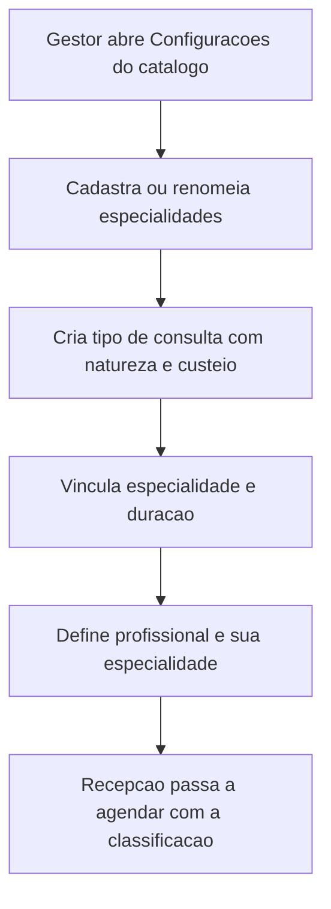

# SPEC-0004 — Catálogo Assistencial e Classificação das Consultas

| Campo | Valor |
| :--- | :--- |
| **ID** | SPEC-0004 |
| **Título** | Especialidades, tipos de consulta (natureza e custeio), edição de cadastros e desbloqueio de agenda |
| **Status** | Implementada |
| **Versão** | 1.0 |
| **Data** | 2026-10-01 |
| **Autor** | Agente de IA (Codex), sob revisão do responsável pelo projeto |
| **Revisores** | Responsável pelo projeto CANAMED |
| **Módulos afetados** | backend / frontend / banco |
| **ADRs relacionados** | ADR-0003, ADR-0007, ADR-0008, ADR-0010 |

---

## 1. Objetivo

Permitir que a clínica classifique o que agenda — **natureza** (consulta avulsa ou acompanhamento),
**custeio** (particular ou plano de saúde) e **especialidade** (ortopedia, ginecologia, pediatria…) — e
que consiga corrigir o próprio catálogo sem apoio técnico: editar paciente, editar profissional, alterar
e desativar tipos de consulta e **desbloquear** um horário.

Pergunta de controle do `GEMINI.md`: **isso reduz atrito na rotina da clínica?**
Sim: sem essa classificação a recepção não sabe distinguir uma consulta particular de um retorno por
convênio, e hoje é impossível desfazer um bloqueio ou corrigir um telefone sem suporte.

## 2. Contexto

- A [SPEC-0002](0002-spec-agenda-de-consultas.md) entregou o agendamento com um catálogo mínimo: o tipo
  de atendimento tinha apenas nome e duração, e não havia edição nem desativação.
- A suíte de testes de comportamento evidenciou duas lacunas concretas: **não existe desbloquear**
  (D-01) e **não existe editar** tipo de atendimento (D-02) nem paciente (D-03).
- A [SPEC-0003](0003-spec-autenticacao-autorizacao-e-auditoria.md) definiu as permissões; a
  configuração do catálogo segue sob `agenda:configure`.
- Decisão do responsável pelo projeto (2026-10-01): os tipos de consulta precisam distinguir
  **avulsa/acompanhamento**, **particular/plano de saúde** e a **especialidade**.

## 3. Escopo

### 3.1 Dentro do escopo

- Catálogo de **especialidades** por clínica (criar, listar, renomear, desativar, reativar).
- **Tipo de consulta** com natureza, custeio, especialidade opcional, duração e situação (ativa/inativa).
- **Vínculo do profissional** a uma especialidade e situação (ativo/inativo).
- **Edição de paciente** (nome, telefone, e-mail e data de nascimento) e situação.
- **Desbloqueio** de intervalo da agenda.
- Regras de integridade: agendamento novo exige tipo, profissional e paciente **ativos**.
- Exposição da classificação na agenda (tela e API), para a recepção enxergar o que está agendando.

### 3.2 Fora do escopo

- Registro completo de convênios (operadora, código ANS, tabela de valores, autorização prévia) — o
  custeio é uma classificação, não um contrato; a gestão de convênios é a SPEC-0006 (P-06 do backlog).
- Cadastro de profissionais com dados de conselho (CRM/CRO) e documentos — SPEC-0006.
- Prontuário, triagem, pagamento, dashboards e notificações.
- Regras comerciais por plano (coparticipação, carência, autorização) e faturamento.

## 4. Atores e Permissões

| Ator | Permissão | Observações |
| :--- | :--- | :--- |
| Gestor | `agenda:configure` | Administra especialidades, tipos de consulta, profissionais e pacientes |
| Recepção | `agenda:write` | Edita paciente, desativa/reativa tipo? **Não**: configuração é do gestor. Edita paciente e desbloqueia horário |
| Profissional | `agenda:block` | Bloqueia e desbloqueia a própria agenda |

Regras de acesso:

- leitura do catálogo: qualquer permissão de agenda (a recepção precisa montar o agendamento);
- escrita do catálogo (especialidades, tipos de consulta, profissionais): `agenda:configure`;
- edição de paciente e desbloqueio: `agenda:write` ou `agenda:block` (o profissional cuida da própria agenda);
- isolamento por `clinic_id` em todas as operações (ADR-0008).

## 5. Regras de Negócio

| ID | Regra | Justificativa |
| :--- | :--- | :--- |
| RN-001 | Todo tipo de consulta tem natureza (`avulsa`, `acompanhamento`) e custeio (`particular`, `plano_saude`). | Classificação pedida pelo responsável; base para relatórios e faturamento futuro |
| RN-002 | Especialidade é opcional no tipo de consulta e no profissional, e sempre pertence à mesma clínica. | Nem toda clínica trabalha com especialidades; o vínculo errado entre clínicas deve ser impossível |
| RN-003 | Um tipo de consulta inativo não pode ser usado em novos agendamentos, mas permanece visível nos agendamentos existentes (RN-002 da SPEC-0002: a duração vigente é copiada na criação). | Histórico íntegro e catálogo enxuto |
| RN-004 | Desativar uma especialidade não é permitido enquanto houver tipo de consulta ou profissional ativo vinculado. | Evita catálogo inconsistente |
| RN-005 | Um profissional inativo não pode receber novos agendamentos; os agendamentos existentes permanecem. | Saída de profissional sem perda de histórico |
| RN-006 | Um paciente inativo não pode receber novos agendamentos; os existentes permanecem. | Paciente que deixou a clínica |
| RN-007 | O desbloqueio remove o bloqueio do horário, que volta a aceitar agendamentos. O evento é auditado. | D-01: hoje o bloqueio é irreversível sem suporte |
| RN-008 | Desbloquear não afeta agendamentos: o bloqueio e o agendamento nunca coexistem no mesmo intervalo. | Consistência da agenda |
| RN-009 | A edição de paciente altera apenas dados cadastrais; agendamentos existentes mantêm a referência ao paciente. | Rastreabilidade |
| RN-010 | Nomes de especialidade e de tipo de consulta são únicos por clínica (sem diferenciar maiúsculas). | Evita duplicidade no catálogo |
| RN-011 | Toda criação, edição, ativação e desativação do catálogo gera evento de auditoria. | RN-013 da SPEC-0002 e GEMINI.md |
| RN-012 | A agenda exibe, para cada agendamento, a natureza, o custeio e a especialidade vigentes no tipo usado. | A recepção precisa reconhecer o que está agendando |

## 6. Fluxos

### 6.1 F-001 — Classificar o catálogo (gestor)

### 6.2 F-002 — Corrigir dados de um paciente

1. A recepção localiza o paciente e abre a edição.
2. Altera nome, telefone, e-mail ou data de nascimento e confirma.
3. O sistema valida, grava, registra auditoria e reflete o novo nome nos agendamentos exibidos.

### 6.3 F-003 — Desbloquear um horário

1. A recepção (ou o profissional, na própria agenda) seleciona o bloqueio do dia.
2. Confirma o desbloqueio.
3. O intervalo volta a aceitar agendamentos e o evento é auditado.

### 6.4 F-004 — Encerrar um tipo de consulta

1. O gestor desativa o tipo que saiu de linha.
2. O tipo deixa de aparecer nas opções de novo agendamento.
3. Os agendamentos existentes continuam exibindo a classificação original.

## 7. Modelo de Dados

| Entidade | Campo | Tipo | Obrigatório | Regra / índice |
| :--- | :--- | :--- | :--- | :--- |
| `specialties` | `id`, `clinic_id`, `name`, `is_active`, `created_at`, `updated_at` | uuid, text, bool | sim | Único em `(clinic_id, lower(name))` |
| `appointment_types` | + `category`, `coverage`, `specialty_id`, `is_active` | text, uuid, bool | `category`/`coverage` sim; `specialty_id` opcional | `category IN ('avulsa','acompanhamento')`; `coverage IN ('particular','plano_saude')`; FK `specialty_id` restrita |
| `professionals` | + `specialty_id`, `is_active` | uuid, bool | `is_active` sim | FK `specialty_id` restrita |
| `patients` | + `email`, `birth_date`, `is_active` | text, date, bool | `is_active` sim; demais opcionais | `birth_date` no passado |

Convenções: `snake_case`, UUID, `timestamptz` em UTC (seção 7 da SPEC-0001).
**LGPD:** `patients.email` e `patients.birth_date` são dados pessoais; `birth_date` é dado pessoal
(não sensível) e não deve aparecer em log. A classificação de custeio (`particular`/`plano_saude`) e a
especialidade revelam condição de saúde quando combinadas com o paciente — permanecem protegidas pelo
isolamento por clínica e não são registradas em log de aplicação.
**Migration:** `AddCatalogClassificationAndEditing`.

## 8. Contrato de API

| Método | Rota | Autorização | Descrição |
| :--- | :--- | :--- | :--- |
| GET | `/api/v1/specialties` | leitura de agenda | Lista especialidades da clínica |
| POST | `/api/v1/specialties` | `agenda:configure` | Cria especialidade |
| POST | `/api/v1/specialties/{id}` | `agenda:configure` | Renomeia especialidade |
| POST | `/api/v1/specialties/{id}/deactivate` | `agenda:configure` | Desativa (bloqueado se houver vínculo ativo) |
| POST | `/api/v1/specialties/{id}/activate` | `agenda:configure` | Reativa |
| POST | `/api/v1/appointment-types` | `agenda:configure` | Cria tipo com natureza, custeio, especialidade e duração |
| POST | `/api/v1/appointment-types/{id}` | `agenda:configure` | Altera tipo |
| POST | `/api/v1/appointment-types/{id}/deactivate` | `agenda:configure` | Desativa tipo |
| POST | `/api/v1/appointment-types/{id}/activate` | `agenda:configure` | Reativa tipo |
| POST | `/api/v1/patients/{id}` | `agenda:write` | Edita paciente |
| POST | `/api/v1/patients/{id}/deactivate` | `agenda:write` | Desativa paciente |
| POST | `/api/v1/patients/{id}/activate` | `agenda:write` | Reativa paciente |
| POST | `/api/v1/professionals/{id}` | `agenda:configure` | Altera nome e especialidade do profissional |
| POST | `/api/v1/professionals/{id}/deactivate` | `agenda:configure` | Desativa profissional |
| POST | `/api/v1/professionals/{id}/activate` | `agenda:configure` | Reativa profissional |
| DELETE | `/api/v1/professionals/{id}/blocks/{blockId}` | `agenda:block` ou `agenda:write` | Remove bloqueio (RN-007) |

Convenções: erros em Problem Details; `409` para conflito de unicidade (RN-010) e para desativação com
vínculo ativo (RN-004); `404` para recurso de outra clínica; respostas de agendamento passam a incluir
`category`, `coverage` e `specialtyName`.

## 9. Interface e Experiência

| Tela | Estado | Comportamento |
| :--- | :--- | :--- |
| Agenda do dia | lista | Cada agendamento mostra natureza, custeio e especialidade |
| Agenda do dia | bloqueio | Ação "Desbloquear" no intervalo bloqueado |
| Novo agendamento | formulário | Tipos agrupados por natureza e custeio; tipos inativos não aparecem |
| Catálogo (gestor) | lista/edição | Especialidades e tipos de consulta com criação, edição e ativação/desativação |
| Pacientes | lista/edição | Edição de nome, telefone, e-mail e data de nascimento |

Linguagem clara em português, identidade visual oficial, contraste WCAG AA e navegação por teclado.

## 10. Critérios de Aceitação

| ID | Critério |
| :--- | :--- |
| CA-001 | **Dado** um gestor autenticado, **Quando** criar um tipo de consulta com natureza `avulsa` e custeio `plano_saude`, **Então** ele aparece no catálogo e nas opções de agendamento, com a classificação. |
| CA-002 | **Dado** um agendamento criado com esse tipo, **Quando** a agenda do dia for consultada, **Então** a resposta informa natureza, custeio e especialidade. |
| CA-003 | **Dado** um tipo de consulta inativo, **Quando** a recepção tentar agendar com ele, **Então** o sistema recusa (`404`, pois o tipo não está disponível para uso no escopo). |
| CA-004 | **Dado** um tipo de consulta com agendamentos, **Quando** o gestor desativá-lo, **Então** os agendamentos existentes permanecem com a classificação original. |
| CA-005 | **Dado** uma especialidade com profissional ativo vinculado, **Quando** o gestor tentar desativá-la, **Então** o sistema recusa com `409`. |
| CA-006 | **Dado** um paciente com telefone incorreto, **Quando** a recepção editar o cadastro, **Então** o novo telefone é persistido e a edição é auditada. |
| CA-007 | **Dado** um paciente inativo, **Quando** a recepção tentar agendá-lo, **Então** o sistema recusa com `404`. |
| CA-008 | **Dado** um intervalo bloqueado, **Quando** a recepção desbloquear, **Então** o horário volta a aceitar agendamento e o evento é auditado. |
| CA-009 | **Dado** dois tipos de consulta com o mesmo nome, **Quando** o gestor criar o segundo, **Então** o sistema recusa com `409`. |
| CA-010 | **Dado** um usuário com apenas `agenda:write`, **Quando** tentar criar um tipo de consulta, **Então** recebe `403`. |

## 11. Casos de Erro

| ID | Gatilho | Comportamento | Mensagem | Registro |
| :--- | :--- | :--- | :--- | :--- |
| ER-001 | Nome duplicado no catálogo | `409` | "Já existe um registro com este nome." | Auditoria do recurso |
| ER-002 | Especialidade com vínculo ativo | `409` | "Esta especialidade está em uso por profissional ou tipo de consulta ativo." | Auditoria |
| ER-003 | Tipo/profissional/paciente inativo no agendamento | `404` | "Registro não encontrado." | Auditoria de acesso negado |
| ER-004 | Natureza ou custeio inválido | `400` | "Classificação inválida." | Log estruturado |
| ER-005 | Duração fora de 1 a 1440 minutos | `400` | "A duração deve estar entre 1 e 1440 minutos." | Log estruturado |
| ER-006 | Data de nascimento no futuro | `400` | "A data de nascimento deve estar no passado." | Log estruturado |
| ER-007 | Bloqueio de outra clínica ou inexistente | `404` | "Registro não encontrado." | Auditoria de acesso negado |
| ER-008 | Sem permissão de configuração | `403` | "Você não tem permissão para executar esta operação." | Auditoria |

## 12. Impacto em Outras Funcionalidades

| Funcionalidade | Tipo | Ação |
| :--- | :--- | :--- |
| Fila de espera (SPEC-0005) | direto | Passa a exibir a classificação do agendamento |
| Pagamentos (P-04) | direto | O custeio (`particular`/`plano_saude`) é a base para cobrança |
| Dashboards (P-05) | direto | Indicadores por natureza, custeio e especialidade |
| Cadastro completo (SPEC-0006) | indireto | Substitui o cadastro mínimo, mantendo os campos criados aqui |
| SPEC-0002 | indireto | Revisão registrada: tipos de consulta deixam de ser apenas nome + duração |

## 13. Requisitos de Segurança

- [ ] Toda operação de catálogo limitada ao `clinic_id` da sessão.
- [ ] Escrita do catálogo restrita a `agenda:configure`; edição de paciente a `agenda:write`.
- [ ] Auditoria de criação, edição, ativação e desativação (RN-011).
- [ ] Validação de entrada em todos os campos (tamanhos, enums, datas).
- [ ] Nenhum dado pessoal de paciente em log de aplicação.
- [ ] Nenhum dado real de paciente em testes ou seeds.

## 14. Requisitos Legais Aplicáveis

| Norma | Aplicável? | O que exige |
| :--- | :--- | :--- |
| LGPD | sim | Minimização (e-mail e data de nascimento opcionais), segurança e rastreabilidade das alterações cadastrais |
| Lei nº 13.787/2018 | não | Não há prontuário nesta funcionalidade |
| CFM / COFEN / ICP-Brasil | não | Sem conteúdo clínico ou assinatura |
| ANVISA RDC nº 657/2022 | não | Software de gestão, sem função diagnóstica |

## 15. Requisitos Não Funcionais

| Categoria | Requisito |
| :--- | :--- |
| Desempenho | Catálogo completo da clínica em menos de 300 ms |
| Manutenibilidade | Regras de classificação isoladas no domínio, testáveis sem banco |
| Consistência | Um único ponto de validação para nome duplicado e vínculo de especialidade |
| Portabilidade | Sem dependência de caminho absoluto ou serviço externo |

## 16. Testes Previstos

| Tipo | Cobertura mínima |
| :--- | :--- |
| Unitário | Enums e rótulos, validação de duração e data, regras de ativação/desativação |
| Integração | CA-001 a CA-010, incluindo desbloqueio, desativação em uso e isolamento por clínica |
| Frontend | Formulário com classificação, edição de paciente e ação de desbloquear |
| Comportamento | Fluxo de desbloqueio e criação de agendamento classificado |

## 17. Auditoria e Observabilidade

| Evento | Recurso | Dados registrados |
| :--- | :--- | :--- |
| Especialidade criada/alterada/desativada | `specialties` | usuário, data, hora, clínica, identificador |
| Tipo de consulta criado/alterado/desativado | `appointment_types` | usuário, data, hora, classificação e duração |
| Profissional alterado/desativado | `professionals` | usuário, data, hora, especialidade |
| Paciente alterado/desativado | `patients` | usuário, data, hora (sem dados pessoais no detalhe) |
| Bloqueio removido | `professional_blocks` | usuário, data, hora, intervalo |

## 18. Decisões e Pendências

### 18.1 Decisões registradas

| ID | Questão | Decisão |
| :--- | :--- | :--- |
| Q-001 | Natureza e custeio em um ou dois campos | **Dois campos**: `category` (avulsa, acompanhamento) e `coverage` (particular, plano de saúde) — são dimensões independentes |
| Q-002 | Especialidade no tipo, no profissional ou em ambos | **Em ambos, opcional**: o profissional tem a especialidade dele; o tipo pode ter a sua (ex.: "Avaliação ortopédica") |
| Q-003 | Convênios completos | Fora de escopo: aqui só a classificação de custeio; operadora/ANS/tabela ficam na SPEC-0006 |
| Q-004 | Desativar em vez de excluir | Catálogo nunca é excluído fisicamente, para preservar histórico e referências |
| Q-005 | Edição de dados pessoais do paciente | Permitida para nome, telefone, e-mail e data de nascimento; CPF/documento fica para a SPEC-0006 |

### 18.2 Pendências

| ID | Pendência | Situação |
| :--- | :--- | :--- |
| P-001 | Convênios completos (operadora, ANS, elegibilidade, autorização) | Depende da SPEC-0006 |
| P-002 | Documentos do paciente (CPF) e do profissional (CRM/CRO) | Depende da SPEC-0006, com validação de dígito e LGPD |
| P-003 | Filtro da agenda por natureza, custeio e especialidade | Depende da SPEC-0005/0008 (dashboards) |
| P-004 | Histórico de alterações visível ao usuário | Trilha de auditoria já registra; interface fica no backlog (I-05) |

## 19. Histórico de Revisões

| Versão | Data | Autor | Alteração |
| :--- | :--- | :--- | :--- |
| 1.0 | 2026-10-01 | Agente de IA (Codex) | Versão inicial, escrita e implementada por instrução direta do responsável pelo projeto (classificação das consultas + lacunas D-01 a D-03 do backlog). |

## 20. Aprovação

| Papel | Nome | Data | Status |
| :--- | :--- | :--- | :--- |
| Autor | Agente de IA (Codex) | 2026-10-01 | Escrita |
| Aprovador | Responsável pelo projeto CANAMED | 2026-10-01 | **Aprovado** — por instrução direta de implementação |
