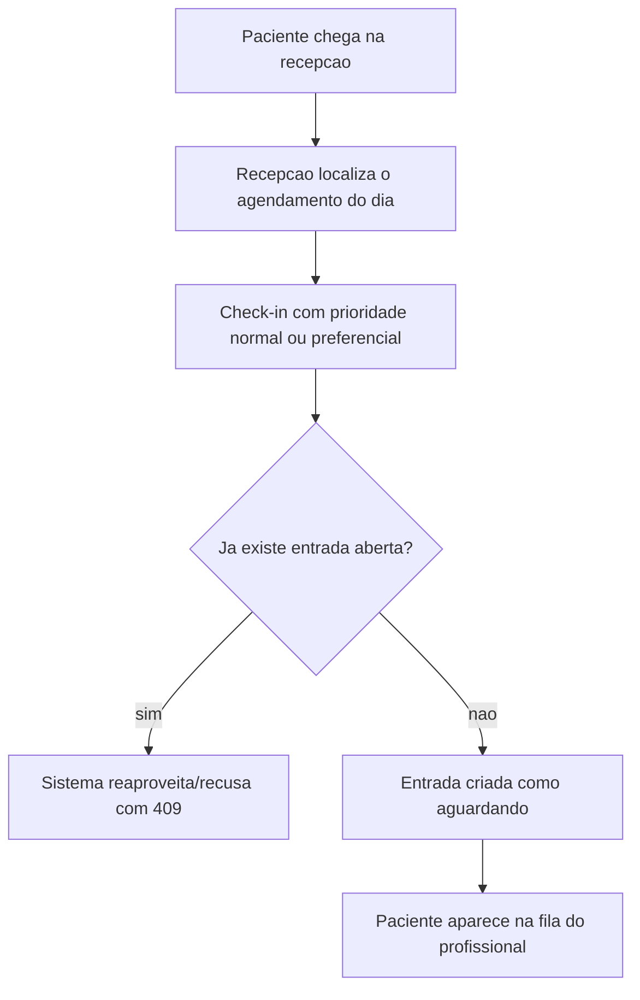

# SPEC-0005 — Fila de Espera e Ciclo de Atendimento

| Campo | Valor |
| :--- | :--- |
| **ID** | SPEC-0005 |
| **Título** | Chegada do paciente, fila de espera por prioridade, início e fim do atendimento e fechamento do dia |
| **Status** | Implementada |
| **Versão** | 1.0 |
| **Data** | 2026-10-01 |
| **Autor** | Agente de IA (Codex), sob revisão do responsável pelo projeto |
| **Revisores** | Responsável pelo projeto CANAMED |
| **Módulos afetados** | backend / frontend / banco |
| **ADRs relacionados** | ADR-0003, ADR-0007, ADR-0008, ADR-0010 |

---

## 1. Objetivo

Tornar visível e previsível o que acontece entre a chegada do paciente e o fim do atendimento:
registrar a chegada, ordenar a espera (com preferência legal), acompanhar chamada e atendimento, e fechar o
dia da agenda sem deixar registros pendentes.

Pergunta de controle do `GEMINI.md`: **isso reduz atrito na rotina da clínica?**
Sim: hoje a clínica não sabe quem chegou, quem está esperando há mais tempo nem quem faltou — e a agenda
acumula agendamentos antigos sem desfecho.

## 2. Contexto

- A [SPEC-0002](0002-spec-agenda-de-consultas.md) entregou agendamento com ciclo de vida
  (`agendado`, `confirmado`, `atendido`, `cancelado`, `faltou`) e as rotas `attend`/`no-show`.
- A [SPEC-0004](0004-spec-catalogo-e-classificacao-das-consultas.md) entregou a classificação das
  consultas e a situação (ativa/inativa) de profissionais e pacientes.
- O backlog ([P-01, P-02](backlog-proximas-funcionalidades.md)) aponta a fila de espera como o item de
  maior ganho operacional sem dependência externa.
- Não há integração externa nesta funcionalidade: nada precisa ser simulado.

## 3. Escopo

### 3.1 Dentro do escopo

- **Check-in** do paciente: a partir de um agendamento do dia ou como **encaixe** (paciente sem
  agendamento, com profissional informado).
- **Prioridade de atendimento**: `normal` ou `preferencial` (idoso, gestante, pessoa com deficiência,
  lactante), conforme boas práticas e o Estatuto da Pessoa Idosa.
- **Fila do dia** por profissional, ordenada por prioridade e ordem de chegada, com posição e tempo de
  espera calculados.
- **Ciclo de atendimento**: `aguardando` → `chamado` → `em_atendimento` → `atendido`, com saídas
  `desistiu` e `cancelado`.
- **Consistência com a agenda**: concluir a fila marca o agendamento como `atendido`; marcar
  `atendido`/`faltou`/`cancelado` na agenda fecha a entrada de fila correspondente.
- **Fechamento do dia**: marcar como falta os agendamentos ativos cujo horário já passou e como
  desistência as entradas de fila ainda em espera, devolvendo um resumo do que foi fechado.

### 3.2 Fora do escopo

- **Observações livres no agendamento ou na fila**: qualquer anotação clínica pertence ao prontuário, com
  guarda de 20 anos, integridade e identificação do profissional (Lei nº 13.787/2018 e CFM). Criar um campo
  livre aqui produziria um "prontuário sombra" sem os controles legais — decisão registrada em Q-004.
- Salas, consultórios e chamada por painel/telão (dependem da SPEC-0006 e de infraestrutura local).
- Notificação ao paciente sobre a posição na fila (SPEC-0007, com provedor externo).
- Relatórios e dashboards de tempo de espera (SPEC de dashboards, P-05).
- Triagem clínica (SPEC própria, P-03).

## 4. Atores e Permissões

| Ator | Permissões | Observações |
| :--- | :--- | :--- |
| Recepcionista | `agenda:read`, `agenda:write` | Faz check-in, chama, inicia, conclui, registra desistência e fecha o dia |
| Profissional | `agenda:read:own`, `agenda:block` | Vê a própria fila e pode **chamar, iniciar e concluir** as entradas da própria agenda |
| Gestor | todas as de agenda | Mesmas ações, com visão de toda a clínica |

Regras de acesso:

- leitura da fila: permissões de leitura de agenda; `agenda:read:own` limita ao próprio profissional;
- check-in, desistência e fechamento do dia: `agenda:write`;
- chamar/iniciar/concluir: `agenda:write` **ou** `agenda:read:own` sobre entrada do próprio profissional;
- isolamento por `clinic_id` em todas as operações (ADR-0008).

## 5. Regras de Negócio

| ID | Regra | Justificativa |
| :--- | :--- | :--- |
| RN-001 | Cada entrada de fila pertence a uma clínica, a um profissional e a um paciente. | Isolamento e rastreabilidade |
| RN-002 | A entrada pode estar vinculada a um agendamento (check-in) ou ser um encaixe sem agendamento. | Cobre chegada com e sem hora marcada |
| RN-003 | Um agendamento não pode ter duas entradas de fila abertas ao mesmo tempo. | Evita duplicidade na fila |
| RN-004 | Ordem da fila: **preferencial primeiro**, depois por ordem de chegada; empate resolvido por ordem de criação. | Preferência legal e previsibilidade |
| RN-005 | Transições válidas: `aguardando` → `chamado` → `em_atendimento` → `atendido`; saídas `desistiu` (de `aguardando` ou `chamado`) e `cancelado` (de `aguardando` ou `chamado`). Estados terminais não voltam. | Ciclo de vida explícito |
| RN-006 | Concluir a entrada de fila marca o agendamento vinculado como `atendido`. | A fila e a agenda contam a mesma história |
| RN-007 | Marcar o agendamento como `atendido` conclui a entrada de fila vinculada; `faltou` a marca como `desistiu`; `cancelado` a marca como `cancelado`. | Consistência nas duas direções |
| RN-008 | Transições repetidas da mesma entrada são idempotentes quando o estado já é o desejado. | Tela com dois cliques não gera erro confuso |
| RN-009 | O tempo de espera é calculado (chegada → chamada) e o tempo de atendimento (início → fim); nada disso é editado pelo usuário. | Indicador confiável |
| RN-010 | Não é permitido check-in em data diferente do dia atual da clínica. | A fila é do dia |
| RN-011 | Paciente, profissional e agendamento precisam estar ativos e pertencer à clínica do usuário. | Integridade multi-clínica |
| RN-012 | Fechar o dia marca como `faltou` os agendamentos `agendado`/`confirmado` cujo fim já passou e como `desistiu` apenas as entradas de fila ainda em `aguardando` **cujo agendamento vinculado também já terminou**. Entradas em `chamado`/`em_atendimento` e encaixes sem agendamento são apenas reportados. | Fecha o dia sem descartar quem ainda espera por um atendimento de hoje |
| RN-013 | Fechar o dia é idempotente: repetir a operação não altera registros já resolvidos e reporta zero. | Operação segura para rodar duas vezes |
| RN-014 | Não é possível fechar um dia futuro. | Evita fechamento acidental |
| RN-015 | Toda mutação gera evento de auditoria (check-in, chamada, início, conclusão, desistência, cancelamento e fechamento do dia). | GEMINI.md (Auditoria) |
| RN-016 | A fila nunca expõe dado de paciente de outra clínica nem detalhe clínico (não há campo clínico nesta funcionalidade). | LGPD e RN-014 da SPEC-0002 |

## 6. Fluxos

### 6.1 F-001 — Chegada com agendamento

### 6.2 F-002 — Chamada e atendimento

1. A recepção (ou o profissional, na própria fila) chama o próximo: `aguardando` → `chamado`.
2. Ao entrar no consultório, inicia o atendimento: `chamado` → `em_atendimento`.
3. Ao terminar, conclui: `em_atendimento` → `atendido`; o agendamento vinculado passa a `atendido`.

### 6.3 F-003 — Encaixe sem agendamento

1. A recepção registra o check-in informando paciente, profissional e prioridade.
2. A entrada entra na mesma fila e segue o fluxo normal.
3. Nenhum agendamento é criado automaticamente (a agenda continua sendo a fonte da verdade dos horários).

### 6.4 F-004 — Desistência

1. A recepção registra que o paciente desistiu (`desistiu`).
2. O agendamento vinculado permanece como estava; a decisão sobre falta é do fechamento do dia.

### 6.5 F-005 — Fechamento do dia

1. A recepção escolhe a data (hoje ou passada) e, opcionalmente, um profissional.
2. O sistema marca os agendamentos vencidos sem desfecho como `faltou` e as entradas em espera como
   `desistiu`.
3. Devolve o resumo: quantos agendamentos foram marcados como falta, quantas filas desistiram e o que
   continua aberto (em atendimento).

## 7. Modelo de Dados

| Entidade | Campo | Tipo | Obrigatório | Regra / índice |
| :--- | :--- | :--- | :--- | :--- |
| `queue_entries` | `id`, `clinic_id`, `professional_id`, `patient_id`, `appointment_id`, `queue_date`, `priority`, `status`, `arrived_at`, `called_at`, `started_at`, `finished_at`, `created_at`, `updated_at` | uuid, date, text, timestamptz | `appointment_id` opcional; demais sim | Índice em `(clinic_id, queue_date, professional_id)`; único parcial em `(appointment_id)` para entradas abertas; `priority IN ('normal','preferencial')`; `status IN ('aguardando','chamado','em_atendimento','atendido','desistiu','cancelado')` |

Regras de integridade:

- `queue_date` é a **data local da clínica** (`America/Fortaleza`), não UTC — a fila é um conceito do dia
  de trabalho (os instantes continuam em `timestamptz`).
- O único parcial `(appointment_id) WHERE status IN ('aguardando','chamado','em_atendimento')` garante a
  RN-003 também sob concorrência.
- FKs para `clinics`, `professionals`, `patients` e `appointments` com `RESTRICT`.
- **Classificação LGPD**: a entrada revela que a pessoa é paciente de uma clínica (dado sensível de saúde);
  não há campo clínico nesta tabela pela decisão Q-004.
- Retenção: mesma política dos agendamentos; a política definitiva pertence à SPEC de privacidade.
- Migrations: `AddWaitingQueue`.

## 8. Contrato de API

| Método | Rota | Autorização | Descrição |
| :--- | :--- | :--- | :--- |
| POST | `/api/v1/queue/check-in` | `agenda:write` | Check-in por agendamento **ou** encaixe (paciente + profissional) |
| GET | `/api/v1/queue?date=` | leitura de agenda | Fila do dia com posição e tempos |
| POST | `/api/v1/queue/{id}/call` | `agenda:write` ou própria entrada | Chama o paciente |
| POST | `/api/v1/queue/{id}/start` | `agenda:write` ou própria entrada | Inicia o atendimento |
| POST | `/api/v1/queue/{id}/complete` | `agenda:write` ou própria entrada | Conclui o atendimento e marca o agendamento como `atendido` |
| POST | `/api/v1/queue/{id}/leave` | `agenda:write` ou própria entrada | Registra desistência |
| POST | `/api/v1/agenda/close-day` | `agenda:write` | Fecha o dia (data + profissional opcional) e devolve o resumo |

Convenções:

- erros em Problem Details (RFC 7807);
- `409` com `type` `queue-entry-conflict` quando o agendamento já tem entrada aberta e
  `queue-invalid-state` em transição não permitida;
- `400` para check-in fora do dia atual (`queue-not-today`), data futura no fechamento
  (`future-day-close`) e encaixe sem paciente/profissional;
- `404` para recurso fora do escopo da clínica (mesmo comportamento da SPEC-0002).

Resposta da fila (por entrada): `id`, `appointmentId`, `patientId`, `patientName`, `professionalId`,
`priority`, `status`, `position`, `arrivedAt`, `calledAt`, `startedAt`, `finishedAt`,
`waitingMinutes`, `serviceMinutes`, `appointmentStartsAt`.

## 9. Interface e Experiência

| Tela | Estado | Comportamento |
| :--- | :--- | :--- |
| Fila do dia (nova aba Recepção) | lista | Ordenada por prioridade e chegada, com posição, tempo de espera e status |
| Fila do dia | vazio | "Nenhum paciente na fila desta data." |
| Fila do dia | carregando/erro | Esqueleto de carregamento e mensagem com ação de tentar novamente |
| Check-in | formulário | Seleciona agendamento do dia **ou** paciente e profissional (encaixe) e a prioridade |
| Agenda do dia | ação | Botão **Check-in** no agendamento e indicador de que o paciente está na fila |
| Fechamento do dia | confirmação | Exige confirmação e mostra o resumo do que foi fechado |

Linguagem clara, identidade visual oficial, contraste WCAG AA e navegação por teclado.

## 10. Critérios de Aceitação

| ID | Critério |
| :--- | :--- |
| CA-001 | **Dado** um agendamento do dia, **Quando** a recepção fizer o check-in, **Então** a entrada aparece na fila do profissional com status `aguardando` e posição calculada. |
| CA-002 | **Dado** um paciente sem agendamento, **Quando** a recepção registrar o encaixe, **Então** a entrada entra na mesma fila sem criar agendamento. |
| CA-003 | **Dado** dois pacientes aguardando, um `preferencial` que chegou depois, **Quando** a fila for consultada, **Então** o preferencial aparece em primeiro lugar. |
| CA-004 | **Dado** um paciente chamado, **Quando** o atendimento for iniciado e concluído, **Então** o agendamento vinculado passa a `atendido` e a entrada fica `atendido`. |
| CA-005 | **Dado** um paciente aguardando, **Quando** a recepção registrar desistência, **Então** a entrada fica `desistiu` e sai da lista de espera ativa. |
| CA-006 | **Dado** um agendamento com check-in feito, **Quando** a recepção tentar um segundo check-in no mesmo agendamento, **Então** o sistema recusa com `409`. |
| CA-007 | **Dado** um paciente já atendido pela agenda (`attend`), **Quando** a fila for consultada, **Então** a entrada vinculada aparece como `atendido`. |
| CA-008 | **Dado** um agendamento cancelado com check-in feito, **Quando** a fila for consultada, **Então** a entrada aparece como `cancelado`. |
| CA-009 | **Dado** um dia com agendamentos vencidos e fila parada, **Quando** a recepção fechar o dia, **Então** os agendamentos passam a `faltou`, as entradas em espera a `desistiu` e o resumo informa os totais. |
| CA-010 | **Dado** um dia já fechado, **Quando** a recepção fechar novamente, **Então** o resumo informa zero e nenhum registro muda. |
| CA-011 | **Dado** um usuário de outra clínica, **Quando** tentar chamar uma entrada da fila, **Então** recebe `404`. |
| CA-012 | **Dado** um profissional com `agenda:read:own`, **Quando** tentar chamar entrada de outro profissional, **Então** recebe `403`. |
| CA-013 | **Dado** um check-in para data diferente de hoje, **Quando** enviado, **Então** o sistema recusa com `400`. |

## 11. Casos de Erro

| ID | Gatilho | Comportamento | Mensagem | Registro |
| :--- | :--- | :--- | :--- | :--- |
| ER-001 | Agendamento já tem entrada aberta | `409` | "Este agendamento já está na fila." | Auditoria |
| ER-002 | Transição inválida (ex.: concluir sem iniciar) | `409` | "Esta entrada da fila não pode mudar para este status." | Auditoria |
| ER-003 | Check-in fora do dia atual | `400` | "O check-in é sempre para o dia de hoje." | Log |
| ER-004 | Encaixe sem paciente ou profissional | `400` | "Informe o paciente e o profissional." | Log |
| ER-005 | Recurso de outra clínica | `404` | "Registro não encontrado." | Auditoria de acesso negado |
| ER-006 | Profissional sem permissão sobre a entrada | `403` | "Você não tem permissão para acessar a fila deste profissional." | Auditoria |
| ER-007 | Fechamento de dia futuro | `400` | "Não é possível fechar um dia que ainda não aconteceu." | Log |
| ER-008 | Banco indisponível | `503` | "Serviço temporariamente indisponível." | Log estruturado |

## 12. Impacto em Outras Funcionalidades

| Funcionalidade | Tipo | Ação |
| :--- | :--- | :--- |
| Agenda (SPEC-0002) | direto | Ganha o botão de check-in e o desfecho em massa no fechamento do dia |
| Dashboards (P-05) | direto | Consome `queue_entries` para tempo de espera e volume |
| Notificações (P-07) | indireto | Poderá avisar o paciente sobre a posição na fila |
| Triagem (P-03) | direto | Parte do paciente em `em_atendimento` |
| Prontuário (futuro) | indireto | Recebe o atendimento concluído; observações clínicas ficam lá, não aqui (Q-004) |

## 13. Requisitos de Segurança

- [ ] Isolamento por `clinic_id` e por profissional (quando `agenda:read:own`).
- [ ] Autorização por recurso em todas as rotas; listagem restrita ao escopo do usuário.
- [ ] Integridade da RN-003 garantida no banco (índice único parcial), não só na aplicação.
- [ ] Transições validadas no domínio e protegidas contra transição duplicada concorrente (trava por entrada).
- [ ] Auditoria de todas as mutações, incluindo o fechamento do dia.
- [ ] Nenhum dado clínico nesta funcionalidade; nenhum dado de paciente em log de aplicação.
- [ ] Nenhum dado real de paciente em testes ou seeds.

## 14. Requisitos Legais Aplicáveis

| Norma | Aplicável? | O que exige |
| :--- | :--- | :--- |
| LGPD | sim | Dado sensível por inferência (paciente da clínica); minimização, segurança e rastreabilidade |
| Estatuto da Pessoa Idosa (Lei nº 10.741/2003) e boas práticas de atendimento preferencial | sim | A fila precisa respeitar prioridade de atendimento (campo `priority`) |
| Lei nº 13.787/2018 (prontuário) | não | Nenhum conteúdo clínico é registrado aqui (Q-004); o prontuário terá SPEC própria |
| CFM / COFEN / ICP-Brasil / ANVISA | não | Sem registro clínico, assinatura ou função diagnóstica |

## 15. Requisitos Não Funcionais

| Categoria | Requisito |
| :--- | :--- |
| Desempenho | Fila de um dia com até 200 entradas em menos de 500 ms |
| Concorrência | Dois check-ins simultâneos no mesmo agendamento não podem gerar duas entradas abertas |
| Observabilidade | `traceId` nas respostas de erro; logs estruturados sem dados pessoais |
| Manutenibilidade | Regras de ordem e transição isoladas no domínio, testáveis sem banco |

## 16. Testes Previstos

| Tipo | Cobertura mínima |
| :--- | :--- |
| Unitário | Ordem por prioridade e chegada, posição, transições válidas e inválidas, idempotência, cálculo de tempos |
| Integração | CA-001 a CA-013, incluindo concorrência de check-in, consistência com a agenda e fechamento do dia |
| Frontend | Estados da fila, ordenação exibida e ações de chamada/conclusão |
| Comportamento | Check-in, chamada, conclusão e fechamento do dia na interface |

## 17. Auditoria e Observabilidade

| Evento | Recurso | Dados registrados |
| :--- | :--- | :--- |
| Check-in registrado | `queue_entries` | usuário, data, hora, clínica, profissional, prioridade, agendamento (quando houver) |
| Paciente chamado | `queue_entries` | usuário, data, hora, entrada |
| Atendimento iniciado | `queue_entries` | usuário, data, hora, entrada, tempo de espera |
| Atendimento concluído | `queue_entries` | usuário, data, hora, entrada, duração |
| Desistência registrada | `queue_entries` | usuário, data, hora, etapa em que desistiu |
| Dia fechado | `agenda` | usuário, data, hora, data fechada, totais por desfecho |

## 18. Decisões e Pendências

### 18.1 Decisões registradas

| ID | Questão | Decisão |
| :--- | :--- | :--- |
| Q-001 | Fila por profissional ou única da clínica | **Por profissional** (uma fila por agenda), com visão consolidada para quem tem `agenda:read` |
| Q-002 | Ordem da fila | Preferencial primeiro, depois ordem de chegada (RN-004); a posição é calculada na leitura, não armazenada |
| Q-003 | Encaixe cria agendamento? | **Não**: o encaixe entra só na fila; a agenda continua sendo a fonte da verdade dos horários |
| Q-004 | Observações livres no agendamento ou na fila | **Não nesta SPEC**: anotação clínica exige prontuário com guarda de 20 anos, integridade e identificação do profissional. Fica na SPEC de prontuário |
| Q-005 | Preferência legal | Campo `priority` (`normal`/`preferencial`) suficiente nesta versão; categorias específicas (idoso, gestante, PCD) ficam para a SPEC de prontuário/dashboards |
| Q-006 | Fechamento do dia | Marca falta e desistência apenas do que já terminou, reporta o que continua aberto e é idempotente (RN-012 a RN-014). Encaixes sem agendamento nunca são fechados automaticamente, porque não têm horário de referência |

### 18.2 Pendências

| ID | Pendência | Situação |
| :--- | :--- | :--- |
| P-001 | Painel/telão de chamada na recepção | Depende de SPEC-0006 (salas e infraestrutura local) |
| P-002 | Aviso ao paciente sobre a posição na fila | Depende da SPEC-0007 (notificações, com provedor externo a contratar) |
| P-003 | Indicadores de tempo de espera e de atendimento | Depende da SPEC de dashboards (P-05) |
| P-004 | Encaminhamento para triagem | Depende da SPEC-0006/P-03 |
| P-005 | Observações administrativas e clínicas | Depende da SPEC de prontuário (Q-004): exige guarda de 20 anos, assinatura e identificação profissional |

## 19. Histórico de Revisões

| Versão | Data | Autor | Alteração |
| :--- | :--- | :--- | :--- |
| 1.0 | 2026-10-01 | Agente de IA (Codex) | Versão inicial, escrita e implementada por instrução direta do responsável pelo projeto (itens P-01 e P-02 do backlog). |

## 20. Aprovação

| Papel | Nome | Data | Status |
| :--- | :--- | :--- | :--- |
| Autor | Agente de IA (Codex) | 2026-10-01 | Escrita |
| Aprovador | Responsável pelo projeto CANAMED | 2026-10-01 | **Aprovado** — por instrução direta de implementação |
